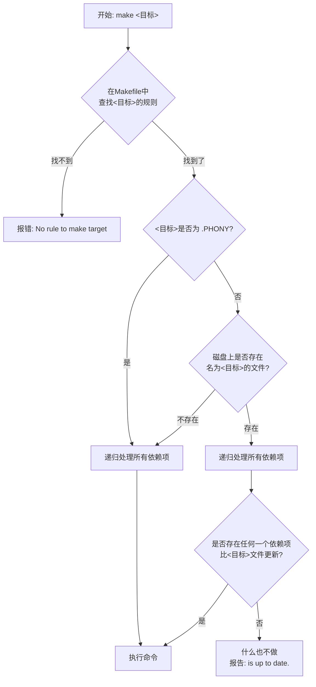

本章主要涉及在linux中搭建一个stm32f4的开发环境，因为bootloader的开发需要在linux系统上进行。

同时之后用到的ESP32-C3的开发也是需要在linux中做的。

## 为什么Bootloader程序编写必须在Linux环境下进行？

您理论上可以在 Windows 上配置复杂的交叉编译环境（如使用 Cygwin、MinGW/MSYS2），或者在 macOS 上（使用 Homebrew 等），但几乎所有 Bootloader（如 U-Boot, GRUB, Barebox）的开发者和社区都默认您在使用 Linux。

**核心原因在于：编译 Bootloader 不仅仅是“编译” (Compile)，它是一个复杂的“构建过程” (Build Process)，这个过程严重依赖 Linux/Unix 的生态系统。**

#### 工具链 (Toolchain) 的原生支持

- **交叉编译器 (Cross-Compiler)**：Bootloader 通常运行在 ARM、MIPS、RISC-V 等非 x86 架构上，而我们的开发电脑是 x86。这就需要“交叉编译”。
- **GNU Toolchain (GCC, Binutils)**：GCC（编译器）、`ld`（链接器）、`as`（汇编器）、`objcopy`（格式转换器）等工具是编译 Bootloader 的基石。这些工具诞生于 Unix 环境，在 Linux 上是“一等公民”，安装、配置和使用都最简单、最稳定。

#### 如果在Windows上下载gcc的eabi，能否不在Linux上编译？

您在 Windows 上安装的 `arm-linux-gnueabi-gcc.exe` 只是整个工具链中的一个（尽管是核心）工具。一个完整的 Bootloader 项目，其编译过程（`Makefile`）中，除了调用 `gcc` 之外，还严重依赖**几十个在 Linux 中“理所当然”存在，但在 Windows 中“完全没有”的工具**。

即使您在 Windows 上有了 GCC，您仍然缺少：

**1. POSIX Shell (如 Bash)**

Bootloader 的 `Makefile` 并不是一个简单的编译列表，它包含了成百上千行的 `bash` 脚本。Windows 的 `cmd.exe` 或 `PowerShell` 无法解释这些脚本。

**2. GNU Coreutils (核心工具集)**

在编译过程中，`Makefile` 会不断调用这些小工具来处理文件、配置和数据：

- `sed` & `awk`：用于动态修改配置文件和源代码。
- `grep`：用于搜索。
- `dd`：用于精确地创建和填充二进制镜像。
- `tr`：用于转换字符。
- `cat`, `cp`, `mv`, `rm`, `mkdir`：这些基本命令的参数和行为在 Linux 和 Windows 上都有细微但致命的差别。

**3. 专门的构建工具**

- `make`：您需要 GNU Make。虽然有 Windows 版本的 `make` (gnumake)，但它本身并不能解决上述 shell 和 coreutils 的缺失。

## 插件安装

1. remote ssh
2. wsl
3. EditorConfig for VS Code

## 创建目录和必要文件

安装editorconfig之后需要在右侧项目根目录里右击创建一个.editorconfig文件，该文件规定了文件被保存后自动格式化的一些配置。


下载最新版的stm32f4标准外设库，准备向项目中添加文件。

```
STM32F4xx_DSP_StdPeriph_Lib_V1.9.0\Libraries\CMSIS\Include\
	arm_common_tables.h
	arm_const_structs.h
	arm_math.h
	core_cm4.h
	core_cmFunc.h
	core_cmInstr.h
	core_cmSimd.h
	
STM32F4xx_DSP_StdPeriph_Lib_V1.9.0\Libraries\CMSIS\Device\ST\STM32F4xx\Include\
	stm32f4xx.h
	system_stm32f4xx.h

STM32F4xx_DSP_StdPeriph_Lib_V1.9.0\Project\STM32F4xx_StdPeriph_Templates\
	stm32f4xx_conf.h
	stm32f4xx_it.c
	stm32f4xx_it.h
	system_stm32f4xx.c
	
STM32F4xx_DSP_StdPeriph_Lib_V1.9.0\Libraries\CMSIS\Device\ST\STM32F4xx\Source\Templates\gcc_ride7\
	startup_stm32f40xx.s
	
STM32F4xx_DSP_StdPeriph_Lib_V1.9.0\Libraries\STM32F4xx_StdPeriph_Driver\inc\*
STM32F4xx_DSP_StdPeriph_Lib_V1.9.0\Libraries\STM32F4xx_StdPeriph_Driver\src\*
```

添加完成后如下


## 添加vscode目录索引

在顶部搜索框输入`> c/c++`打开`c_cpp_properties.json`文件，编辑后变成如下样式：

```json
{
    "configurations": [
        {
            "name": "stm32f4_boot",
            "includePath": [
                "boot",
                "platform/cmsis/core",
                "platform/cmsis/device",
                "platform/driver/inc"
            ],
            "defines": [
                
            ]
        }
    ],
    "version": 4
}
```

## 添加链接脚本(.ld)文件

在platform目录里添加一个`stm32f407vetx_flash.ld`文件，内容如下：

```c
/* Entry Point */
ENTRY(Reset_Handler)

/* Highest address of the user mode stack */
_estack = ORIGIN(RAM) + LENGTH(RAM);    /* end of RAM */
/* Generate a link error if heap and stack don't fit into RAM */
_Min_Heap_Size = 0x200;      /* required amount of heap  */
_Min_Stack_Size = 0x400; /* required amount of stack */

/* Specify the memory areas */
MEMORY
{
    RAM (xrw)    : ORIGIN = 0x20000000, LENGTH = 128K
    CCMRAM (xrw) : ORIGIN = 0x10000000, LENGTH = 64K
    FLASH (rx)   : ORIGIN = 0x8000000, LENGTH = 32K
}

/* Define output sections */
SECTIONS
{
  /* The startup code goes first into FLASH */
  .isr_vector :
  {
    . = ALIGN(4);
    KEEP(*(.isr_vector)) /* Startup code */
    . = ALIGN(4);
  } >FLASH

  /* The program code and other data goes into FLASH */
  .text :
  {
    . = ALIGN(4);
    *(.text)           /* .text sections (code) */
    *(.text*)          /* .text* sections (code) */
    *(.glue_7)         /* glue arm to thumb code */
    *(.glue_7t)        /* glue thumb to arm code */
    *(.eh_frame)

    KEEP (*(.init))
    KEEP (*(.fini))

    . = ALIGN(4);
    _etext = .;        /* define a global symbols at end of code */
  } >FLASH

  /* Constant data goes into FLASH */
  .rodata :
  {
    . = ALIGN(4);
    *(.rodata)         /* .rodata sections (constants, strings, etc.) */
    *(.rodata*)        /* .rodata* sections (constants, strings, etc.) */
    . = ALIGN(4);
  } >FLASH

  .ARM.extab   : { *(.ARM.extab* .gnu.linkonce.armextab.*) } >FLASH
  .ARM : {
    __exidx_start = .;
    *(.ARM.exidx*)
    __exidx_end = .;
  } >FLASH

  .preinit_array     :
  {
    PROVIDE_HIDDEN (__preinit_array_start = .);
    KEEP (*(.preinit_array*))
    PROVIDE_HIDDEN (__preinit_array_end = .);
  } >FLASH
  .init_array :
  {
    PROVIDE_HIDDEN (__init_array_start = .);
    KEEP (*(SORT(.init_array.*)))
    KEEP (*(.init_array*))
    PROVIDE_HIDDEN (__init_array_end = .);
  } >FLASH
  .fini_array :
  {
    PROVIDE_HIDDEN (__fini_array_start = .);
    KEEP (*(SORT(.fini_array.*)))
    KEEP (*(.fini_array*))
    PROVIDE_HIDDEN (__fini_array_end = .);
  } >FLASH

  /* used by the startup to initialize data */
  _sidata = LOADADDR(.data);

  /* Initialized data sections goes into RAM, load LMA copy after code */
  .data :
  {
    . = ALIGN(4);
    _sdata = .;        /* create a global symbol at data start */
    *(.data)           /* .data sections */
    *(.data*)          /* .data* sections */

    . = ALIGN(4);
    _edata = .;        /* define a global symbol at data end */
  } >RAM AT> FLASH

  _siccmram = LOADADDR(.ccmram);

  /* CCM-RAM section
  *
  * IMPORTANT NOTE!
  * If initialized variables will be placed in this section,
  * the startup code needs to be modified to copy the init-values.
  */
  .ccmram :
  {
    . = ALIGN(4);
    _sccmram = .;       /* create a global symbol at ccmram start */
    *(.ccmram)
    *(.ccmram*)

    . = ALIGN(4);
    _eccmram = .;       /* create a global symbol at ccmram end */
  } >CCMRAM AT> FLASH


  /* Uninitialized data section */
  . = ALIGN(4);
  .bss :
  {
    /* This is used by the startup in order to initialize the .bss secion */
    _sbss = .;         /* define a global symbol at bss start */
    __bss_start__ = _sbss;
    *(.bss)
    *(.bss*)
    *(COMMON)

    . = ALIGN(4);
    _ebss = .;         /* define a global symbol at bss end */
    __bss_end__ = _ebss;
  } >RAM

  /* User_heap_stack section, used to check that there is enough RAM left */
  ._user_heap_stack :
  {
    . = ALIGN(8);
    PROVIDE ( end = . );
    PROVIDE ( _end = . );
    . = . + _Min_Heap_Size;
    . = . + _Min_Stack_Size;
    . = ALIGN(8);
  } >RAM


  /* Remove information from the standard libraries */
  /DISCARD/ :
  {
    libc.a ( * )
    libm.a ( * )
    libgcc.a ( * )
  }

  .ARM.attributes 0 : { *(.ARM.attributes) }
}
```

这里解释一下ld文件的作用，如果把整个编译过程比作盖房子：

- **编译器 (Compiler)**：像是把钢筋、水泥、砖块等原材料（你的`.c`源代码）制作成标准化的预制板和墙壁（`.o`目标文件）。
- **链接器 (Linker)**：像是**建筑施工队**，负责把所有的预制板和墙壁组装成一栋完整的建筑（`.elf`/`.axf`可执行文件）。

那么，**`.ld` 文件就是这支施工队的“建筑蓝图”**。它以一种精确的脚本语言，**指挥链接器如何将所有的代码和数据，精确地放置到STM32芯片的内存地图（Flash、SRAM）中**。

---

### **`.ld` 文件的四大核心任务**

#### 1. 🗺️ 定义内存布局 (Define Memory Layout)

脚本首先会告诉链接器，我们手头的这块STM32芯片“长什么样”，它有哪些存储区域，分别在哪里，有多大。

**示例代码 (简化版):**

```
MEMORY
{
  FLASH (rx) : ORIGIN = 0x08000000, LENGTH = 512K
  SRAM (rwx) : ORIGIN = 0x20000000, LENGTH = 128K
}
```

- `(rx)` 和 `(rwx)` 分别代表了该区域的权限：`r`=读, `w`=写, `x`=执行

#### 2. 🏠 指定段的存放位置 (Specify Section Placement)

这是链接器脚本最核心的功能。它会详细规定编译后产生的各个“段”（Section），应该被放置到哪个内存区域。

示例代码 (简化版):

```c
SECTIONS
{
  /* 中断向量表必须放在Flash的最开头 */
  .isr_vector :
  {
    . = ALIGN(4);
    KEEP(*(.isr_vector)) /* 保留中断向量表 */
    . = ALIGN(4);
  } >FLASH

  /* .text段 (所有程序代码) 放入Flash */
  .text :
  {
    *(.text*)
  } >FLASH

  /* .data段 (已初始化变量) */
  .data :
  {
    _sdata = .; /* 定义一个符号_sdata，指向.data段的起始地址 */
    *(.data*)
    _edata = .;
  } >SRAM AT> FLASH /* 运行时在SRAM，但其初始值镜像存放在FLASH */

  /* .bss段 (未初始化变量) 放入SRAM */
  .bss :
  {
    _sbss = .;
    *(.bss*)
    *(COMMON)
    _ebss = .;
  } >SRAM
}
```

- `>FLASH` 和 `>SRAM` 就是指令，告诉链接器把这些段放到之前`MEMORY`命令定义的区域中。
- **关键点**：`.data`段的处理。`>SRAM AT> FLASH` 意思是，这个段**运行时**的地址在SRAM中，但它需要一个**加载地址**在FLASH中。这完美地解释了为什么**启动代码需要从Flash把数据复制到SRAM**。

```c
/* 中断向量表 */
.isr_vector :
{
    . = ALIGN(4);
    KEEP(*(.isr_vector)) /* 保留中断向量表 */
        . = ALIGN(4);
} >FLASH
```

> **`.isr_vector :`**
>
> - 语法：`output_section_name :`
> - 解释：定义一个名为 `.isr_vector` 的 **输出段**。所有后续花括号 `{}` 内的内容都将合并到这个输出段中。
>
> **`. = ALIGN(4);`**
>
> - 语法：`. = expression;`
> - 解释：
>   - **`.`**：这是一个特殊的符号，称为**定位计数器 (Location Counter)**。它表示当前在输出段中的地址。
>   - **`ALIGN(4)`**：这是一个函数，它返回下一个是4的倍数的地址。
>   - 整条语句的意思是：“将当前的地址（定位计数器）推进到下一个4字节对齐的位置”。在ARM架构中，指令和向量表条目通常需要4字节对齐，这是一个保证硬件能正确读取的操作。
>
> **`KEEP(\*(.isr_vector))`**
>
> - 语法：`KEEP(input_section_spec)`
> - 解释：
>   - `*`：是一个通配符，表示“来自于所有输入的`.o`目标文件”。
>   - `(.isr_vector)`：表示输入文件中名为 `.isr_vector` 的段。
>   - `*(.isr_vector)` 的意思是：“将所有输入文件中的 `.isr_vector` 段内容集合到这里”。
>   - **`KEEP(...)`**：这是一个非常重要的指令。链接器为了优化空间，可能会丢弃它认为“未使用”的代码或数据段（死代码消除）。`KEEP` 强制告诉链接器：“**无论你觉得这个段有没有被引用，都必须保留它，不准丢弃！**”。中断向量表是硬件直接访问的，没有任何软件代码会“调用”它，所以必须用`KEEP`来保护。
>
> **`>FLASH`**
>
> - 语法：`> memory_region`
> - 解释：将整个 `.isr_vector` 输出段放置到 `MEMORY` 命令中定义的名为 `FLASH` 的内存区域中。

```c
/* 程序代码 */
.text :
 {
   *(.text*)
 } >FLASH
```

> **`.text :`**
>
> - 解释：定义一个名为 `.text` 的输出段。
>
> **`\*(.text\*)`**
>
> - 解释：这里的 `*` 是通配符。`(.text*)` 意味着匹配所有输入文件中以 `.text` 开头的段，例如 `.text`、`.text.main`、`.text.foo` 等。这会将所有函数编译后的机器码都收集到这个 `.text` 输出段中。
>
> **`>FLASH`**
>
> - 解释：将整个 `.text` 输出段（即所有代码）放置到 `FLASH` 内存区域中。

```c
/* 已初始化变量 */
.data :
 {
   _sdata = .;
   *(.data*)
   _edata = .;
 } >SRAM AT> FLASH
```

> **`.data :`**
>
> - 解释：定义一个名为 `.data` 的输出段。
>
> **`_sdata = .;`**
>
> - 语法：`symbol_name = .;`
> - 解释：定义一个名为 `_sdata` 的新符号，并将其值设置为当前定位计数器 `.` 的值。此时，`.` 的值是 `.data` 段在SRAM中的起始地址。这个符号可以被启动代码引用，以知道从哪里开始存放变量。
>
> **`\*(.data\*)`**
>
> - 解释：收集所有输入文件中以 `.data` 开头的段（即所有已初始化的全局变量和静态变量）。
>
> **`_edata = .;`**
>
> - 解释：定义一个名为 `_edata` 的新符号，其值为当前定位计数器 `.` 的值，也就是 `.data` 段在SRAM中的结束地址。
>
> **`>SRAM AT> FLASH`**
>
> - 语法：`> vma_region AT> lma_region`
> - 解释：这是链接器脚本中最关键的语法之一。
>   - **`>SRAM`**: 指定了该段的**运行时地址 (VMA - Virtual Memory Address)**。也就是说，当程序跑起来的时候，这些变量位于 `SRAM` 中。
>   - **`AT> FLASH`**: 指定了该段的**加载地址 (LMA - Load Memory Address)**。也就是说，在生成的 `.bin` 文件中，这些变量的初始值是存放在 `FLASH` 里的。
>   - 启动代码的任务就是根据 LMA (`AT> FLASH`) 在Flash中找到这些数据，然后把它们复制到 VMA (`>SRAM`) 指定的SRAM位置。

```c
/* 未初始化变量 */
.bss :
 {
   _sbss = .;
   *(.bss*)
   *(COMMON)
   _ebss = .;
 } >SRAM
```

> **`.bss :`**
>
> - 解释：定义一个名为 `.bss` 的输出段。
>
> **`_sbss = .;` 和 `_ebss = .;`**
>
> - 解释：同理，定义了两个符号 `_sbss` 和 `_ebss`，分别标记了 `.bss` 段在SRAM中的起始和结束地址。启动代码会使用这两个地址，将这块SRAM区域清零。
>
> **`\*(.bss\*)`**
>
> - 解释：收集所有输入文件中以 `.bss` 开头的段。
>
> **`\*(COMMON)`**
>
> - 解释：`COMMON` 是一种特殊的未初始化数据段。C语言中允许多个文件定义同名的未初始化全局变量，链接器会将它们合并到 `COMMON` 空间。这条指令就是把这些数据也包含进来。
>
> **`>SRAM`**
>
> - 解释：将 `.bss` 段放置到 `SRAM` 内存区域。注意，这里**没有 `AT>`**，因为 `.bss` 段没有初始值需要从Flash加载，它只是在运行时占据一块需要被清零的SRAM空间。

---

**链接器所需的输入文件是什么？**

主要包括两大类：

- 目标文件 (Object Files, `.o` 或 `.obj` 后缀)
  - 在你的STM32项目中，通常会有很多个 `.c` 文件（例如 `main.c`, `usart.c`, `gpio.c` 等）和 `.s` 文件（汇编启动文件）。**编译器（Compiler）会对每一个** `.c` 文件进行独立的编译，将其从C语言翻译成机器码，并生成一个与之对应的 `.o` 目标文件。
  - 这些 `.o` 文件就是链接器的主要输入。它们是半成品，包含了代码和数据，但地址都还没有确定。
- 库文件 (Library Files, `.a` 或 `.lib` 后缀)
  - 库文件本质上就是一堆**预先编译好的`.o`文件的压缩包**。
  - 你在代码中调用了 `printf` 函数，但你并没有写 `printf` 的源代码。这个函数的实现在C标准库 (`.a` 文件)中。链接器会自动从库文件中找到 `printf` 对应的那个 `.o` 文件，并将其作为输入。STM32的HAL库、标准外设库等也是以这种形式提供的。

---

#### 3.✍️ 定义重要符号 (Define Important Symbols)

链接器脚本可以在链接过程中创建一些非常有用的地址符号（你可以理解为“标签”），这些符号可以在C代码或汇编代码中通过`extern`来引用。

- 从上面的例子中，我们看到了 `_sdata`, `_edata`, `_sbss`, `_ebss` 等符号。
- **它们有什么用？** 启动代码 (`startup_stm32f40xx.s`) 需要知道 `.data` 段在Flash中的起始地址、在SRAM中的起始和结束地址，才能正确地进行复制。它也需要知道 `.bss` 段在SRAM中的起始和结束地址，才能正确地进行清零。这些信息就是通过链接器定义的这些符号来传递的。

#### 4. 🚀 指定程序入口点 (Specify the Entry Point)

脚本会明确告诉链接器，程序的“第一行代码”是哪一个函数。对于STM32来说，这永远是`Reset_Handler`。

```c
ENTRY(Reset_Handler)
```

## 指定编译器路径

由于项目使用的是gcc编译器，而不是集成在Keil MDK中的ARMcc或Armclang。

[Downloads | GNU Arm Embedded Toolchain Downloads – Arm Developer](https://developer.arm.com/downloads/-/gnu-rm)

在wsl中输入`uname -a`查看linux系统的架构，

```bash
(base) zyc@Win-20250418BYV:~$ uname -a
Linux Win-20250418BYV 5.15.167.4-microsoft-standard-WSL2 #1 SMP Tue Nov 5 00:21:55 UTC 2024 x86_64 x86_64 x86_64 GNU/Linux
```

所以选择`x86_64`架构的版本：


下载完成后，将压缩包放到工程的根目录里。

之后，在工程的根目录里新建一个目录叫`tools/toolchain/`，解压刚刚下载的文件到该路径：

```bash
tar xjvf gcc-arm-none-eabi-10.3-2021.10-x86_64-linux.tar.bz2 -C tools/toolchain/
```

解压后工程目录如下：


接下来需要配置C/C++的编译器路径，

在上方搜索框输入`> c/c++`打开UI配置，设置编译器路径，这里的UI配置的修改会同步到`c_cpp_properties.json`文件中。


接着继续改动以下几个地方：

- C 标准：C99
- C++ 标准：C++11
- IntelliSense 模式：linux-gcc-arm
- 浏览: 将符号限制为包含的标头：勾上

最后完整的`.vscode/c_cpp_properties.json`为：

```json
{
    "configurations": [
        {
            "name": "stm32f4",
            "includePath": [
                "boot",
                "platform/cmsis/core",
                "platform/cmsis/device",
                "platform/driver/inc"
            ],
            "defines": [],
            "compilerPath": "/home/zyc/Projects/stm32f4/tools/toolchain/gcc-arm-none-eabi-10.3-2021.10/bin/arm-none-eabi-gcc",
            "cStandard": "c99",
            "cppStandard": "c++11",
            "intelliSenseMode": "linux-gcc-arm",
            "browse": {
                "limitSymbolsToIncludedHeaders": true
            }
        }
    ],
    "version": 4
}
```

## Makefile规则

### **1. 变量赋值运算符**

1. `=` (递归展开赋值)：当你使用 `=` 来定义一个变量时，`make` **不会立即计算右侧的值**。它只是简单地记录下这个“配方”。只有当这个变量在后续的规则或命令中**被实际使用时**，`make` 才会去展开和计算它的值。因为这种展开是递归的，所以它会展开所有嵌套的变量引用。

2. `:=` (立即展开赋值)：这个操作符的行为更像大多数常规编程语言中的变量赋值，当你使用 `:=` 来定义一个变量时，`make` 会**立即计算右侧的值**，并将计算出的最终结果（一个固定的字符串）赋给左侧的变量。之后无论其他变量如何变化，这个变量的值都不会再改变。

3. `+=` (追加赋值)：这个操作符用来给一个已经存在的变量追加内容。将右侧的字符串（带一个前导空格）追加到左侧变量的原有值的末尾。**如果变量之前未定义，`+=` 的行为就等同于 `=`**。

   ```makefile
   MY_FLAGS := -Wall  # 推荐用 := 初始化
   
   # ... 其他一些代码 ...
   
   MY_FLAGS += -O2    # 追加 -O2
   
   # ... 又一些代码 ...
   
   MY_FLAGS += -g     # 再次追加 -g
   
   all:
   	@echo $(MY_FLAGS)
       # 最终输出 "-Wall -O2 -g"
   ```

### **2. 编译规则**

`Makefile` 本质上就是一本**“食谱”**，里面写满了制作各种菜肴（目标文件）的方法。

```makefile
# 食谱：如何制作 main.o 这道菜

# 菜名  : 原料1      原料2
main.o: main.c   my_header.h
	# 制作方法
	gcc -c main.c -o main.o
```

- **`main.o`**: 是**目标 (Target)**，也就是我们想制作的“菜”。
- **`main.c`** 和 **`my_header.h`**: 是**依赖项 (Dependencies)**，也就是制作这道菜需要的“原料”。
- **`gcc -c main.c -o main.o`**: 是**命令 (Command)**，也就是具体的“制作步骤”。

### 3. 是否执行命令

您可以把 `make` 想象成一个非常严谨、循规蹈矩的机器人管家，当您命令它 `make <某个目标>` 时，它会严格按照以下步骤来思考和行动：



#### 第 1 步：寻找“食谱”（查找规则）

`make` 会首先翻开它的“食谱”—— `Makefile` 文件，寻找关于如何制作这个 `<目标>` 的规则。

- **如果找不到**任何关于这个 `<目标>` 的规则（即 `目标:` 这样的定义不存在），它会立刻停止工作，并报错：

  > `make: *** No rule to make target '<目标>'. Stop.` （没有制作 `<目标>` 的规则。停止。）

- **如果找到了**，则进入下一步。

#### 第 2 步：判断“目标”的性质（是否为伪目标）

`make` 会检查这个 `<目标>` 是否被 `.PHONY` 声明过。

- **如果是伪目标 (`.PHONY`)**:
  - `make` 的判断是：“哦，这是一个动作指令，不是一个文件。”
  - 它的决定是：**必须执行**这个目标下的命令。
  - **但在执行之前**，它会先去检查这个伪目标的**所有依赖项**，并确保它们都是最新的（它会对每一个依赖项都递归地执行一遍这整个四步判断法）。
  - 当所有依赖项都处理完毕后，它就回来执行 `<目标>` 下的命令。
- **如果不是伪目标** (即它代表一个真实的文件)，则进入下一步。

#### 第 3 步：检查“目标文件”是否存在

`make` 会去磁盘上查看，是否存在一个与 `<目标>` 同名的文件。

- **如果文件不存在**:
  - `make` 的判断是：“目标产品都没有，必须制作。”
  - 它的决定是：**必须执行**这个目标下的命令。
  - 同样，在执行之前，它会先去确保所有的依赖项都是最新的。
- **如果文件存在**，则进入最关键的下一步。

#### 第 4 步：比较“新旧程度”（比较时间戳）

这是 `make` 实现智能编译的核心。

1. `make` 会先去确保该目标的所有依赖项（原料）都已是最新状态（再次递归调用这套算法）。
2. 然后，它会逐一比较**目标文件**的**最后修改时间戳**和**每一个依赖文件**的**最后修改时间戳**。
3. 它会问自己一个问题：“**是否存在任何一个依赖文件，比目标文件还要新？**”

- **如果答案是“是”** (至少有一个依赖项比目标更新):

  - `make` 的判断是：“原料更新了，现有的产品已经过时了。”
  - 它的决定是：**必须执行**命令，用新的原料重新生成目标文件。

- **如果答案是“否”** (所有依赖项都比目标旧，或者一样旧):

  - `make` 的判断是：“现有产品是用最新的原料做的，它本身就是最新的。”

  - 它的决定是：**什么也不做**，并报告目标已是最新。

    > `make: '<目标>' is up to date.`

## Makefile文件编写

为了方便起见，直接使用STM32CubeMX生成Makefile，


此时会在项目文件夹下发现，已经生成了一个Makefile文件：


直接将这个Makfile复制到我们的wsl路径中，并对其进行修改，需要修改如下几个地方：

```makefile
# 项目名称
TARGET = stm32f4

# 源文件所在目录
C_DIRS = \
boot \
platform/cmsis/device \
platform/driver/src

# 所有源文件列表
C_SOURCES = $(wildcard $(addsuffix /*.c, $(C_DIRS)))

# 所有头文件查找路径
C_INCLUDES = \
-Iplatform/cmsis/core \
-Iplatform/cmsis/device \
-Iplatform/driver/inc

# 预定义
C_DEFS = \
-DSTM32F40_41xxx \
-DUSE_STDPERIPH_DRIVER \
-DHSE_VALUE=8000000

# ASM sources
ASM_SOURCES =  \
platform/cmsis/device/startup_stm32f40xx.s

# link script 链接脚本
LDSCRIPT = platform/stm32f407vetx_flash.ld
```

> 解释一下这一行代码
>
> ```makefile
> C_SOURCES = $(wildcard $(addsuffix /*.c, $(C_DIRS)))
> ```
>
> - `$(C_DIRS)`：变量引用，变量本身应该在Makefile的前面某处被定义，它包含了一个或多个存放C源代码的目录（文件夹）路径。
> - `$(addsuffix /*.c, $(C_DIRS))`：它会将第一个参数（这里是 `/*.c`）作为后缀，添加到第二个参数（一个列表，这里是 `$(C_DIRS)` 的内容）中的每一项后面。
>   - 这里提一下makefile函数的使用格式：`$(function argument1, argument2, ...)`
> - `$(wildcard ...)`：它接收一个或多个包含通配符（如 `*`）的模式作为参数，然后去文件系统中**搜索所有匹配该模式的、真实存在的文件**，并返回这些文件的完整路径列表。
>
> 如果需要测试一下获取到的`C_SOURCES`变量是否正确，可以使用打印函数`@echo`在文件结尾加入：
>
> ```
> test:
> 	@echo $(C_SOURCES)
> ```
>
> 以查看该变量的内容。
>
> 注：如果出现了`Makefile:178: *** missing separator. Stop.`错误，是因为makefile文件执行需要严格的制表符，不能用2/4空格来替代，而vscode中默认使用的是空格替代的，所以需要在设置中改为“**使用制表符缩进**”。
>
> 

此时，可以开始`make`编译了，此时会出现如下错误：


可以在该文件中把这一行注释掉，因为main.h中没有任何东西，再次编译，出现如下错误：

发现都是与FMC有关的错误，这里可以直接把FMC源文件删除即可。

还有上面的重定义错误，直接把之后的重定义的内容注释掉即可。

生成如下样式的输出代表项目编译成功：


此时工程搭建大功告成，可以写代码了。

## 更清晰的Makefile

```makefile
CONFIG_BOOTLOADER := y

# 禁用隐含规则
MAKEFLAGS += -rR

# 项目名称
PROJECT_NAME := xcplus

# 目标
# 只有当这个变量尚未被定义时，才对它进行赋值。如果这个变量在此之前已经有值了，那么 ?= 这行语句将什么也不做，直接被忽略。
ifeq ($(CONFIG_BOOTLOADER), y)
TARGET ?= boot
else
TARGET ?= app
endif

# 输出路径
BUILD_BASE := output
ifeq ($(CONFIG_BOOTLOADER), y)
BUILD := $(BUILD_BASE)/$(PROJECT_NAME)_boot
else
BUILD := $(BUILD_BASE)/$(PROJECT_NAME)
endif

# 生成配置
# DEBUG ?= $(CONFIG_DEBUG)
DEBUG ?=
V ?=

# Toolchain
CROSS_COMPILE ?= tools/toolchain/gcc-arm-none-eabi-10.3-2021.10/bin/arm-none-eabi-
KCONF := scripts/kconfig/
ECHO := echo
CP := cp
MKDIR := mkdir -p
PYTHON := python3
OS = $(shell uname -s)
ifeq ($(V),)
QUITE := @
endif

# 平台配置
PLATFORM := stm32f4
MCU := -mthumb -mcpu=cortex-m4 -mfpu=fpv4-sp-d16 -mfloat-abi=hard
LDSCRIPT := platform/stm32f407vetx_flash.ld

# 库文件
LIBS := -lm

# 宏定义
P_DEF :=
P_DEF += STM32F40_41xxx \
		 USE_STDPERIPH_DRIVER \
         HSE_VALUE=8000000
ifeq ($(DEBUG), y)
P_DEF += DEBUG
endif

# 指定头文件所在目录
s_inc-y = boot \
		  component/crc \
		  component/easylogger/inc \
		  component/ringbuffer \
		  platform/cmsis/core \
		  platform/cmsis/device \
		  platform/driver/inc
# 指定源文件所在目录
s_dir-y = boot \
		  boot/override \
		  component/crc \
		  component/ringbuffer \
		  platform/cmsis/device \
		  platform/driver/src

ifeq ($(DEBUG), y)
s_dir-y += component/easylogger/src \
           component/easylogger/port
endif

# 获取源文件列表
s_src-y = $(wildcard $(addsuffix /*.c, $(s_dir-y)))
s_src-y += platform/cmsis/device/startup_stm32f40xx.s

# 获取排序后的头文件和源文件列表
P_INC := $(sort $(s_inc-y))
P_SRC := $(sort $(s_src-y))

# 编译参数
A_FLAGS  = $(MCU) -g
C_FLAGS  = $(MCU) -g
C_FLAGS += -std=gnu11
C_FLAGS += -ffunction-sections -fdata-sections -fno-builtin -fno-strict-aliasing
C_FLAGS += -Wall -Werror
# C_FLAGS += -Wno-int-to-pointer-cast -Wno-pointer-to-int-cast
ifeq ($(DEBUG), y)
C_FLAGS += -Wno-comment -Wno-unused-value -Wno-unused-variable -Wno-unused-function
endif
C_FLAGS += -MMD -MP -MF"$(@:%.o=%.d)"

ifeq ($(DEBUG), y)
C_FLAGS += -O0
else
C_FLAGS += -Os
endif

# 链接参数
L_FLAGS  = $(MCU)
L_FLAGS += -T$(LDSCRIPT)
L_FLAGS += -static -specs=nano.specs
L_FLAGS += -Wl,-cref
L_FLAGS += -Wl,-Map=$(BUILD)/$(TARGET).map
L_FLAGS += -Wl,--gc-sections
L_FLAGS += -Wl,--start-group
L_FLAGS += $(LIBS)
L_FLAGS += -Wl,--end-group

# 依赖对象
B_LIB := $(addprefix $(BUILD)/, $(P_LIB))
B_INC := $(addprefix -I, $(P_INC))
B_DEF := $(addprefix -D, $(P_DEF))
B_OBJ := $(P_SRC)
B_OBJ := $(B_OBJ:.c=.o)
B_OBJ := $(B_OBJ:.s=.o)
B_OBJ := $(addprefix $(BUILD)/, $(B_OBJ))
B_DEP := $(B_OBJ:.o=.d)

LINKERFILE := $(LDSCRIPT)

FORCE_RELY := Makefile

.PHONY: FORCE _all all test clean distclean $(BUILD)/$(TARGET)

all: $(BUILD)/$(TARGET)

-include $(B_DEP)

$(BUILD)/%.o: %.s $(FORCE_RELY)
	$(QUITE)$(ECHO) "  AS    $@"
	$(QUITE)$(MKDIR) $(dir $@)
	$(QUITE)$(CROSS_COMPILE)as -c $(A_FLAGS) $< -o$@

$(BUILD)/%.o: %.c $(FORCE_RELY)
	$(QUITE)$(ECHO) "  CC    $@"
	$(QUITE)$(MKDIR) $(dir $@)
	$(QUITE)$(CROSS_COMPILE)gcc -c $(C_FLAGS) $(B_DEF) $(B_INC) $< -o$@

$(BUILD)/$(TARGET): $(LINKERFILE) $(B_OBJ) $(FORCE_RELY)
	$(QUITE)$(MKDIR) $(BUILD)
	$(QUITE)$(ECHO) "  LD    $@.elf"
	$(QUITE)$(ECHO) "  OBJ   $@.hex"
	$(QUITE)$(ECHO) "  OBJ   $@.bin"
	$(QUITE)$(CROSS_COMPILE)gcc $(B_OBJ) $(L_FLAGS) -o$@.elf
	$(QUITE)$(CROSS_COMPILE)objcopy --gap-fill 0x00 -O ihex $@.elf $@.hex
	$(QUITE)$(CROSS_COMPILE)objcopy --gap-fill 0x00 -O binary -S $@.elf $@.bin
	$(QUITE)$(CROSS_COMPILE)size $@.elf
	$(QUITE)$(ECHO) "  BUILD FINISH"

clean:
	$(QUITE)rm -rf $(BUILD)
	$(QUITE)$(ECHO) "clean up"

distclean:
	$(QUITE)rm -rf $(BUILD_BASE)
	$(QUITE)$(ECHO) "distclean up"

test:
	@echo $(B_OBJ)
	@echo $(B_DEP)

```

下面逐行解释：

```makefile
MCU := -mthumb -mcpu=cortex-m4 -mfpu=fpv4-sp-d16 -mfloat-abi=hard
```

> 定义了将要**传递给GCC编译器的具体CPU架构参数**。
>
> - **`-mthumb`**：告诉编译器生成 **Thumb-2指令集** 的代码。Thumb-2是一种16/32位混合指令集，代码密度高（即更节省空间），非常适合STM32这类内存有限的微控制器。
> - **`-mcpu=cortex-m4`**：精确指定CPU的内核为 **ARM Cortex-M4**。这使得编译器可以使用Cortex-M4内核特有的一些优化和指令（比如部分DSP指令集）。
> - **`-mfpu=fpv4-sp-d16`**：启用硬件**浮点运算单元 (FPU)**
>   - `fpv4-sp` 指的是第4代的**单精度**浮点运算单元。这意味着芯片有专门的硬件来极速处理`float`类型的浮点数运算。
>   - `d16` 指的是FPU寄存器的配置。
> - **`-mfloat-abi=hard`**：指定浮点运算的**应用程序二进制接口 (ABI)** 为“硬浮点”。这意味着编译器在函数之间传递浮点数参数时，会直接使用高速的FPU专用寄存器，而不是通过通用的CPU寄存器或内存来传递。这大大提升了浮点运算的性能。

```makefile
A_FLAGS  = $(MCU) -g
C_FLAGS  = $(MCU) -g
C_FLAGS += -std=gnu11
C_FLAGS += -ffunction-sections -fdata-sections -fno-builtin -fno-strict-aliasing
C_FLAGS += -Wall -Werror
ifeq ($(DEBUG), y)
C_FLAGS += -Wno-comment -Wno-unused-value -Wno-unused-variable -Wno-unused-function
endif
C_FLAGS += -MMD -MP -MF"$(@:%.o=%.d)"

ifeq ($(DEBUG), y)
C_FLAGS += -O0
else
C_FLAGS += -Os
endif
```

> - **`-g`**: 告诉汇编器在输出的目标文件中包含**调试信息**。这对于在调试器中单步调试汇编代码至关重要。
>
> - `C_FLAGS` - C编译器参数
>
>   - **`-std=gnu11`**: 指定使用 **C11语言标准**，并包含一些GCC特有的扩展功能。
>   - **`-ffunction-sections`** 和 **`-fdata-sections`**: 这是一对非常重要的优化选项。它们让编译器把每个函数和每个变量都分别放到独立的代码段/数据段中。这样做的好处是，链接器后续可以配合 `--gc-sections` 选项进行“垃圾回收”，**丢弃掉所有未被使用的函数和变量**，从而有效减小最终固件的大小。
>   - **`-fno-builtin`**: 禁用编译器对某些标准库函数的内置优化版本（例如`memcpy`），确保使用的是你所链接的C库中的版本。
>   - **`-fno-strict-aliasing`**: 关闭严格的别名规则。这是一个与C语言指针相关的优化选项，关闭它可以增加代码的健壮性，避免一些因编译器过度优化而导致的潜在问题。
>   - **`-Wall`**: 开启**所有**常用的编译警告，帮助你发现潜在的代码问题。
>   - **`-Werror`**: 将所有的编译**警告**都当作**错误**来处理。这意味着，只要代码中有一个警告，编译就会失败，强制开发者必须修复它，这是一种保证高质量代码的严格策略。
>
>   - **`-MMD -MP -MF"$(@:%.o=%.d)"`**：实现**增量编译**（或者叫智能编译）。它能让`make`程序精确地知道，当你修改了某一个头文件（`.h`文件）时，到底需要重新编译哪几个包含了它的源文件（`.c`文件），而不是每次都编译所有文件。这在大型项目中可以大大节省编译时间。
>   - **`C_FLAGS += -O0`**: 如果是调试模式，就将优化等级设置为 **-O0**（数字零）。这代表**不进行任何优化**。这样做能确保编译出的机器码和你的源代码高度一致，从而获得最好的调试体验（例如，可以精确地设置断点、单步跟踪代码流程、查看变量值）。
>   - **`C_FLAGS += -Os`**: 如果**不是**调试模式（即为发布模式），则将优化等级设置为 **-Os**。这会告诉编译器**优先为减小代码尺寸而优化**。这对于Flash空间有限的微控制器来说至关重要。

```makefile
L_FLAGS  = $(MCU)
L_FLAGS += -T$(LDSCRIPT)
L_FLAGS += -static -specs=nano.specs
L_FLAGS += -Wl,-cref
L_FLAGS += -Wl,-Map=$(BUILD)/$(TARGET).map
L_FLAGS += -Wl,--gc-sections
L_FLAGS += -Wl,--start-group
L_FLAGS += $(LIBS)
L_FLAGS += -Wl,--end-group
```

> - `-T$(LDSCRIPT)`
>   - **-T**: 这个参数告诉链接器，不要使用默认的内存布局，而是使用一个指定的**链接器脚本 (Linker Script)**。
>   - **$(LDSCRIPT)**: 这个变量存放的就是我们之前讨论过的`.ld`文件的路径。这个脚本文件是芯片的“内存地图蓝图”。
> - `-static -specs=nano.specs`
>   - **-static**: 告诉链接器执行**静态链接**，将所有需要的库代码都完整地包含到最终的`.elf`文件中。这使得固件可以独立运行，是裸机嵌入式系统的标准做法。
>   - **-specs=nano.specs**: 指示链接器使用 **Newlib-nano** 这个C标准库版本。Newlib是专为嵌入式系统设计的C库，而“nano”版本是它的一个分支，经过特别优化，以**极大地减小代码尺寸**为目标。它会牺牲一些功能（比如默认不支持`printf`打印浮点数）来节省宝贵的Flash和RAM空间。
>
> - `-Wl,...` 系列参数
>   - `-Wl,` 是一个特殊的前缀，它的作用是**将逗号后面的参数直接传递给链接器程序（`ld`）**，而不是由编译器驱动程序（`gcc`）自己处理。
>   - **`L_FLAGS += -Wl,-Map=$(BUILD)/$(TARGET).map`**：指示链接器生成一个 **Map文件**。这是一个非常详细的文本报告，会列出你的程序中每一个函数、每一个变量的最终内存地址和大小。它是分析和调试内存问题的无价之宝。
>   - **`L_FLAGS += -Wl,--gc-sections`**：启用**“垃圾回收” (Garbage Collection)** 功能。它会和编译参数 `-ffunction-sections`、`-fdata-sections` 协同工作。链接器会扫描整个项目，**移除所有从未被调用过的函数和从未被使用过的变量**，从而显著减小最终固件的大小。
>   - **`L_FLAGS += -Wl,--start-group` 和 `L_FLAGS += -Wl,--end-group`**：这两个参数通常成对出现，用来解决库文件之间复杂的**循环依赖**问题。它们告诉链接器，**请反复地扫描夹在它们中间的库（这里是`$(LIBS)`）**，直到所有函数和变量的引用关系都被满足为止。这在链接像C库这样由多个部分组成的库时非常必要。

```makefile
B_LIB := $(addprefix $(BUILD)/, $(P_LIB))
B_INC := $(addprefix -I, $(P_INC))
B_DEF := $(addprefix -D, $(P_DEF))
B_OBJ := $(P_SRC)
B_OBJ := $(B_OBJ:.c=.o)
B_OBJ := $(B_OBJ:.s=.o)
B_OBJ := $(addprefix $(BUILD)/, $(B_OBJ))
B_DEP := $(B_OBJ:.o=.d)
```

> - **`B_INC := $(addprefix -I, $(P_INC))`**
>
>   - **解释**: 这是非常实用的一步。将一个纯粹的目录列表，转换成编译器能够完全识别的、可以直接在命令行中使用的**头文件搜索路径参数**。它接收 `$(P_INC)` 这个存放着所有头文件目录的列表（例如 `boot component/crc`），然后使用 `addprefix` 为**每一项**都加上 `-I` 前缀。
>   - **转换过程**:
>     - 输入: `boot component/crc ...`
>     - 输出 (`B_INC`): `-Iboot -Icomponent/crc ...`
>
> - **`B_DEF := $(addprefix -D, $(P_DEF))`**
>
>   - **解释**: 与上一行类似。将一个纯粹的宏定义列表，转换成编译器可以直接使用的**宏定义参数**。它接收 `$(P_DEF)` 这个存放着所有宏定义的列表（例如 `STM32F40_41xxx DEBUG`），然后为**每一项**都加上 `-D` 前缀。
>   - **转换过程**:
>     - 输入: `STM32F40_41xxx DEBUG ...`
>     - 输出 (`B_DEF`): `-DSTM32F40_41xxx -DDEBUG ...`
>
> - **`B_OBJ := $(P_SRC)`** 
>
>    **`B_OBJ := $(B_OBJ:.c=.o)`** 
>
>    **`B_OBJ := $(B_OBJ:.s=.o)`** 
>
>    **`B_OBJ := $(addprefix $(BUILD)/, $(B_OBJ))`**
>
>   - 这是一个**分步处理**的过程，用来生成最终所有**目标文件 (Object Files)** 的列表。
>
>   - **第一步**: `B_OBJ := $(P_SRC)`
>
>     - 先将之前找到的所有源文件列表 (`.c` 和 `.s` 文件) 赋值给 `B_OBJ`。
>
>     **第二步**: `B_OBJ := $(B_OBJ:.c=.o)`
>
>     - 使用**后缀替换**的语法，将 `B_OBJ` 列表中所有以 `.c` 结尾的文件名，都替换为以 `.o` 结尾。
>
>     **第三步**: `B_OBJ := $(B_OBJ:.s=.o)`
>
>     - 同理，将所有以 `.s` 结尾的文件名，也替换为以 `.o` 结尾。
>
>     **第四步**: `B_OBJ := $(addprefix $(BUILD)/, $(B_OBJ))`
>
>     - 最后，为列表中每一个 `.o` 文件路径的前面，都加上 `$(BUILD)/` 这个输出目录前缀。
>
>     **目的**: 经过这四步，`B_OBJ` 变量现在包含了**所有最终需要生成的目标文件 (`.o` 文件) 的完整路径列表**。这个列表是后续链接步骤的关键依赖。
>
> - **`B_DEP := $(B_OBJ:%.o=%.d)`**：根据最终的目标文件列表，生成一个与之对应的**依赖文件 (Dependency Files) 列表**。这些 `.d` 文件是由编译器自动生成的，用来记录每个源文件所依赖的头文件，是实现增量编译的核心。遍历 `B_OBJ` 列表，将列表中每一项文件名末尾的 `.o` 替换为 `.d`。
>   - **转换过程**:
>     - 输入 (`B_OBJ`): `output/xcplus_boot/boot/main.o ...`
>     - 输出 (`B_DEP`): `output/xcplus_boot/boot/main.d ...`

```makefile
.PHONY: FORCE _all all test clean distclean $(BUILD)/$(TARGET)
```

这是一个**特殊的目标 (Special Target)**，名为 `.PHONY`。它用来声明一系列目标为**“伪目标” (Phony Targets)**。

> 这是用于将`FORCE`,`_all`,`all`这些目标声明为伪目标。
>
> ```bash
> make clean
> ```
>
> make命令后面的参数可以是 **伪目标** 或者 **目标文件名**。
>
> `.PHONY` 的作用就是**改变 `make` 程序的默认天性**。`make` 的天性是：**把所有目标（Target）都当作文件名来对待，并通过比较文件时间戳来决定是否执行命令。**
>
> 而 `.PHONY` 就是你贴的一个**特殊标签**，它告诉 `make`：“听着，对于我用 `.PHONY` 声明的这个目标（比如 `clean`），请你**放弃你的天性**。它**不是一个文件名**，它只是一个**纯粹的动作别名**。以后无论何时调用它，你都必须**无条件地、不假思索地**执行它下面的命令，不要去检查磁盘，也不要比较时间戳。”
>
> 上述例子中，如果存在一个名为`clean`的文件，即符合前面提到的`<Makefile规则-3.是否执行命令-第3步>`中的“目标文件已存在”的情况，此时转第4步，查看Makefile文件中涉及`clean`目标文件生成的规则中的依赖文件是否比目标文件`clean`要新，
>
> ```makefile
> clean:
> 	$(QUITE)rm -rf $(BUILD)
> 	$(QUITE)$(ECHO) "clean up"
> ```
>
> 该clean规则不涉及依赖文件，所以没有文件比目标文件要新，所以就不会执行规则规定的步骤，直接输出`make: '<目标>' is up to date.`
>
> 


```makefile
all: $(BUILD)/$(TARGET)

-include $(B_DEP)

$(BUILD)/%.o: %.s $(FORCE_RELY)
	$(QUITE)$(ECHO) "  AS    $@"
	$(QUITE)$(MKDIR) $(dir $@)
	$(QUITE)$(CROSS_COMPILE)as -c $(A_FLAGS) $< -o$@

$(BUILD)/%.o: %.c $(FORCE_RELY)
	$(QUITE)$(ECHO) "  CC    $@"
	$(QUITE)$(MKDIR) $(dir $@)
	$(QUITE)$(CROSS_COMPILE)gcc -c $(C_FLAGS) $(B_DEF) $(B_INC) $< -o$@

$(BUILD)/$(TARGET): $(LINKERFILE) $(B_OBJ) $(FORCE_RELY)
	$(QUITE)$(MKDIR) $(BUILD)
	$(QUITE)$(ECHO) "  LD    $@.elf"
	$(QUITE)$(ECHO) "  OBJ   $@.hex"
	$(QUITE)$(ECHO) "  OBJ   $@.bin"
	$(QUITE)$(CROSS_COMPILE)gcc $(B_OBJ) $(L_FLAGS) -o$@.elf
	$(QUITE)$(CROSS_COMPILE)objcopy --gap-fill 0x00 -O ihex $@.elf $@.hex
	$(QUITE)$(CROSS_COMPILE)objcopy --gap-fill 0x00 -O binary -S $@.elf $@.bin
	$(QUITE)$(CROSS_COMPILE)size $@.elf
	$(QUITE)$(ECHO) "  BUILD FINISH"
```

> ```makefile
> all: $(BUILD)/$(TARGET)
> 
> -include $(B_DEP)
> ```
>
> **`all: $(BUILD)/$(TARGET)`**
>
> - 这一行定义了**默认目标**。当你只输入 `make` 命令时，`make` 就会尝试构建 `all` 这个目标。
> - 它有一个依赖项 `$(BUILD)/$(TARGET)`，也就是最终的可执行文件（ `output/xcplus_boot/boot/`）。因此，运行 `make` 的最终效果就是去执行生成这个文件的规则。
>
> **`-include $(B_DEP)`**
>
> - 这是一个实现**增量编译**的核心指令。
> - **`include`**: 告诉 `make` 去读取 `$(B_DEP)` 变量（即所有 `.d` 依赖文件列表）中指定的每一个文件，并将它们的内容就像 Makefile 本身的一部分一样包含进来。这些 `.d` 文件是由编译器自动生成的，里面记录了每个 `.c` 文件依赖于哪些 `.h` 头文件。
> - **`-` (前缀)**: 开头的 `-` 告诉 `make`：“如果这些 `.d` 文件找不到，**不要报错**，直接忽略就行”。这在第一次编译（`.d`文件还不存在）或执行 `make clean` 后是必需的。
>
> ```makefile
> $(BUILD)/%.o: %.s $(FORCE_RELY)
> 	$(QUITE)$(ECHO) "  AS    $@"
> 	$(QUITE)$(MKDIR) $(dir $@)
> 	$(QUITE)$(CROSS_COMPILE)as -c $(A_FLAGS) $< -o$@
> ```
>
> **模式规则 (Pattern Rules)**，它们为 `make` 提供了通用的“配方”。匹配`%.o`目标文件怎么生成呢，就根据这个规则生成。
>
> - 原材料是`%.s`文件
>
> - `$(ECHO) " AS ..."`: 打印一条状态信息，告诉用户正在汇编哪个文件。`$@` 是一个**自动变量**，代表目标文件（如 `build/startup_stm32f407xx.o`）。
>
> - `$(MKDIR) $(dir $@)`: 在生成 `.o` 文件之前，确保其所在的目录存在。
>
> - `$(CROSS_COMPILE)as ...`: 这是实际的**汇编命令**。`$<` 是另一个自动变量，代表第一个依赖项（即 `.s` 源文件）。
>
>   - 调用交叉编译工具链中的**汇编器 (as)**，将一个 `.s` 汇编源文件，转换成一个包含机器码的 `.o` 目标文件。
>
>   - 组合起来如下
>
>     ```bash
>     @arm-none-eabi-as -mthumb -mcpu=cortex-m4 -g Core/Startup/startup_stm32f407xx.s -o build/Core/Startup/startup_stm32f407xx.o
>     ```
>
> ```makefile
> $(BUILD)/%.o: %.c $(FORCE_RELY)
> 	$(QUITE)$(ECHO) "  CC    $@"
> 	$(QUITE)$(MKDIR) $(dir $@)
> 	$(QUITE)$(CROSS_COMPILE)gcc -c $(C_FLAGS) $(B_DEF) $(B_INC) $< -o$@
> ```
>
> - `$(BUILD)/%.o: %.c ...`：与上一条类似，这条规则告诉 `make` 如何从一个 `.c` (C语言) 源文件，生成对应的 `.o` 目标文件。
>
> - `$(CROSS_COMPILE)gcc ...`: 这是实际的**C语言编译命令**。它使用了我们之前定义的所有变量：`C_FLAGS` (编译参数), `B_DEF` (-D宏定义), `B_INC` (-I头文件路径)。组合起来如下
>
>   ```bash
>   @arm-none-eabi-gcc \
>   -c \
>   -mthumb -mcpu=cortex-m4 -mfpu=fpv4-sp-d16 -mfloat-abi=hard -g -std=gnu11 -ffunction-sections -fdata-sections -fno-builtin -fno-strict-aliasing -Wall -Werror -Os -MMD -MP -MF"output/xcplus_boot/boot/boot.d" \
>   -DSTM32F40_41xxx -DUSE_STDPERIPH_DRIVER -DHSE_VALUE=8000000 \
>   -Iboot -Iplatform/cmsis/core -Iplatform/driver/inc \
>   boot/boot.c \
>   -o output/xcplus_boot/boot/boot.o
>   ```
>
> ```makefile
> $(BUILD)/$(TARGET): $(LINKERFILE) $(B_OBJ) $(FORCE_RELY)
> 	$(QUITE)$(MKDIR) $(BUILD)
> 	$(QUITE)$(ECHO) "  LD    $@.elf"
> 	$(QUITE)$(ECHO) "  OBJ   $@.hex"
> 	$(QUITE)$(ECHO) "  OBJ   $@.bin"
> 	$(QUITE)$(CROSS_COMPILE)gcc $(B_OBJ) $(L_FLAGS) -o$@.elf
> 	$(QUITE)$(CROSS_COMPILE)objcopy --gap-fill 0x00 -O ihex $@.elf $@.hex
> 	$(QUITE)$(CROSS_COMPILE)objcopy --gap-fill 0x00 -O binary -S $@.elf $@.bin
> 	$(QUITE)$(CROSS_COMPILE)size $@.elf
> 	$(QUITE)$(ECHO) "  BUILD FINISH"
> ```
>
> ```makefile
> $(BUILD)/$(TARGET): $(LINKERFILE) $(B_OBJ) $(FORCE_RELY)
> ```
>
> 这行代码定义了如何构建最终目标 `$(BUILD)/$(TARGET)`（例如 `output/xcplus_boot/boot`）。
>
> **目标**: `$(BUILD)/$(TARGET)` 是我们最终想要生成的产品。
>
> **依赖项**:
>
> - `$(LINKERFILE)`: 依赖于**链接器脚本** (`.ld`文件)。如果修改了内存布局，需要重新链接。
> - `$(B_OBJ)`: 依赖于**所有**编译生成的`.o`目标文件。任何一个`.o`文件更新了，都需要重新链接。
> - `$(FORCE_RELY)`: 依赖于`Makefile`本身。如果修改了链接参数等规则，也需要重新链接。
>
> 当所有依赖项都准备好后，`make`会按顺序执行以下命令：
>
> 1. **`$(QUITE)$(MKDIR) $(BUILD)`**
>    - **作用**: 确保输出目录存在。
>    - **解释**: 这是一个安全措施，在开始生成文件之前，先确保顶层输出目录（如 `output/xcplus_boot`）已经被创建。
> 2. **`$(QUITE)$(ECHO) "..."`**
>    - **作用**: 打印状态信息。
>    - **解释**: 在屏幕上显示 `LD ...` `OBJ ...` 等信息，让用户知道当前正在进行链接和格式转换。
> 3. **`$(QUITE)$(CROSS_COMPILE)gcc $(B_OBJ) $(L_FLAGS) -o$@.elf`**
>    - **作用**: **执行链接**。
>    - **解释**: 这是核心步骤。调用`gcc`作为驱动程序来启动链接器(`ld`)，将所有的`.o`文件 (`$(B_OBJ)`) 根据链接参数 (`$(L_FLAGS)`) 组合在一起，生成一个包含调试信息的、**ELF格式**的可执行文件（例如 `boot.elf`）。
> 4. **`$(QUITE)$(CROSS_COMPILE)objcopy --gap-fill 0x00 -O ihex $@.elf $@.hex`**
>    - **作用**: **转换为 HEX 格式**。
>    - **解释**: 调用`objcopy`工具，读取`.elf`文件，并将其转换为**Intel HEX格式**的文件。HEX文件是一种文本格式，常用于烧录器软件。`--gap-fill 0x00` 确保文件中任何空的地址区域都被填充为0。
> 5. **`$(QUITE)$(CROSS_COMPILE)objcopy --gap-fill 0x00 -O binary -S $@.elf $@.bin`**
>    - **作用**: **转换为 BIN 格式**。
>    - **解释**: 再次调用`objcopy`，这次使用 `-O binary` 选项生成一个纯粹的**二进制镜像文件** (`.bin`)。这个文件就是程序在芯片Flash中存储内容的一模一样的副本。`-S` 选项会移除所有符号和重定位信息。
> 6. **`$(QUITE)$(CROSS_COMPILE)size $@.elf`**
>    - **作用**: **显示内存占用**。
>    - **解释**: 调用`size`工具分析`.elf`文件，并打印出程序最终占用了多少Flash空间（`.text`+`.data`）和RAM空间（`.data`+`.bss`）。这对开发者评估资源使用情况非常有用。
> 7. **`$(QUITE)$(ECHO) " BUILD FINISH"`**
>    - **作用**: 打印结束信息。
>    - **解释**: 告诉用户整个构建过程已成功完成。

