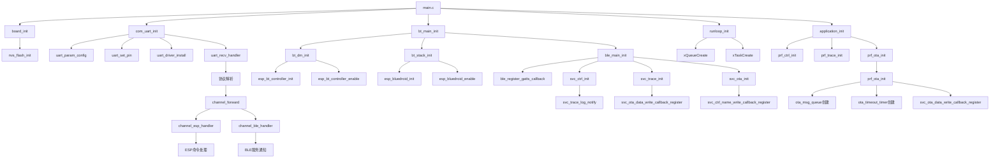

# 1. 项目概述

这是一个基于 ESP-IDF 框架的 ESP32-C3 项目，名为 "skybridge"，主要功能是作为蓝牙网桥，提供串口通信和蓝牙功能。

需要注意的是：**ESP-IDF 开发的程序是依赖于 FreeRTOS 的，而不是裸机程序。简单来说，FreeRTOS 是 ESP-IDF 框架的核心基础。**

当您使用 ESP-IDF 时，您**始终**是在一个实时操作系统（RTOS）的环境下进行开发。这为您带来了多任务并行处理、实时响应和模块化设计的便利，但也意味着您不能像编写传统单片机裸机程序那样（例如，在一个大的 `while(1)` 循环里处理所有事情）来思考问题。

**ESP32-C3的启动流程**：

1. 芯片上电后，首先运行引导加载程序(bootloader)
2. bootloader加载应用程序
3. ESP-IDF框架初始化硬件和FreeRTOS
4. 最后调用用户的应用程序入口函数(app_main)

# 2. 主要初始化流程

## 2.1 app_main() 主函数

   - 调用 board_init() - 初始化板级功能（主要是 NVS 非易失性存储）
   - 调用 com_uart_init() - 初始化 UART 串口通信
   - 调用 bt_main_init() - 初始化蓝牙功能
   - 设置自定义日志打印函数 _log_vprintf，可以将日志通过其他通道(如BLE服务)发送
   - 调用 runloop_init() - 初始化运行循环队列系统
   - 调用 application_init() - 初始化应用层功能

## 2.2 各个初始化模块功能

### 2.2.1 板级初始化 (board_init)

   - 初始化非易失性存储(NVS)，用于存储键值对数据

### 2.2.2 UART 通信初始化 (com_uart_init)

   - 配置 UART1，波特率 115200
   - 设置 TX/RX 引脚为 GPIO4/GPIO5
   - 创建串口接收任务，解析特定协议格式的数据帧

### 2.2.3 蓝牙初始化 (bt_main_init)

   - 初始化蓝牙设备管理(bt_dm)
   - 初始化蓝牙协议栈(bt_stack)
   - 初始化 BLE 功能(ble_main)

### 2.2.4 应用层初始化 (application_init)

   - 初始化控制功能(prf_ctrl)
   - 初始化跟踪功能(prf_trace)
   - 初始化 OTA 功能(prf_ota)

### 2.2.5 运行循环 (runloop) 系统

   - 创建一个 FreeRTOS 队列和任务
   - 允许其他模块将任务添加到队列中执行
   - 提供线程安全的任务执行机制

### 2.2.6 特点

   - 支持串口和蓝牙通信的桥接功能
   - 具备 OTA (空中升级) 功能
   - 数据传输使用特定协议格式，包含魔数、通道、长度和 CRC 校验
   - 具备日志重定向功能，可将日志信息通过其他通道传输

这是一个典型的物联网设备固件，主要功能是作为串口到蓝牙的网桥设备，允许通过蓝牙接口访问串口设备，并支持无线固件升级。



# 3. 串口部分流程

## 3.1 串口初始化

```c
void com_uart_init(void)                          // UART初始化函数
{
    esp_err_t ret;                                // ESP32错误码

    const uart_config_t uart_config =             // UART配置结构体
    {
        .baud_rate = COM_UART_BAUD,               // 设置波特率
        .data_bits = UART_DATA_8_BITS,            // 数据位：8位
        .parity    = UART_PARITY_DISABLE,         // 奇偶校验：禁用
        .stop_bits = UART_STOP_BITS_1,            // 停止位：1位
        .flow_ctrl = COM_UART_FLOW,               // 流控：根据宏定义设置
        .source_clk = UART_SCLK_APB,              // 时钟源：APB时钟
    };

    ret = uart_param_config(COM_UART_INST, &uart_config);  // 配置UART参数
    ESP_ERROR_CHECK(ret);                         // 检查配置是否成功

    ret = uart_set_pin(COM_UART_INST, COM_UART_PAD_TX, COM_UART_PAD_RX, COM_UART_PAD_RTS, COM_UART_PAD_CTS);  // 设置UART引脚
    ESP_ERROR_CHECK(ret);                         // 检查引脚设置是否成功

    ret = uart_driver_install(COM_UART_INST, COM_UART_RX_BUF_SIZE, COM_UART_TX_BUF_SIZE, 0, NULL, 0);  // 安装UART驱动
    ESP_ERROR_CHECK(ret);                         // 检查驱动安装是否成功

    com_recv_mux = xSemaphoreCreateMutex();       // 创建接收互斥锁
    configASSERT(com_recv_mux);                   // 确保互斥锁创建成功

    xTaskCreate(uart_recv_handler, "com uart", 4096, NULL, 9, &com_recv_task);  // 创建接收任务
}

```

串口初始化流程：

- `uart_param_config()`配置UART参数
- `uart_set_pin()`设置UART引脚
- `uart_driver_install()`安装UART驱动

  ```c
  esp_err_t uart_driver_install(uart_port_t uart_num, int rx_buffer_size, int tx_buffer_size, int queue_size, QueueHandle_t* uart_queue, int intr_alloc_flags)
  ```

  1. **uart_num**: UART端口号，可以是UART_NUM_0、UART_NUM_1或UART_NUM_2
  2. **rx_buffer_size**: 接收缓冲区大小（以字节为单位）
  3. **tx_buffer_size**: 发送缓冲区大小（以字节为单位）
  4. **queue_size**: UART事件队列大小，用于存储UART事件（如数据接收、缓冲区满等）
  5. **uart_queue**: 指向队列句柄的指针，用于接收UART事件队列句柄
  6. **intr_alloc_flags**: 中断分配标志，用于指定中断分配的属性

  > **使用freertos完成串口接收数据**
  >
  > **初始化 (Setup)：**
  >
  > - 创建一个 FreeRTOS **队列** (`xQueueCreate()`)。这个队列将用于存放从 UART 接收到的字节。
  > - 创建一个**任务** (`xTaskCreate()`)，我们称之为 `uart_rx_task`。
  > - 配置 UART 硬件，并**使能“接收中断”（RXNE 中断）**。
  >
  > **等待数据 (Task Side)：**
  >
  > - `uart_rx_task` 任务在一个循环中调用 `xQueueReceive()`。
  > - 它会尝试从队列中读取数据。由于队列是空的，FreeRTOS 会自动将这个任务置于**阻塞状态**。
  > - 此时，`uart_rx_task` 不消耗任何 CPU 时间，调度器会去运行其他就绪的任务。
  >
  > **数据到达 (ISR Side)：**
  >
  > - 一个字节的数据通过 RX 引脚到达 UART 硬件。
  > - UART 硬件自动将数据从移位寄存器存入其数据寄存器 (Data Register)。
  > - 硬件触发 CPU 的 UART 接收中断。
  > - CPU 暂停当前任务，跳转到您定义的 **UART 中断服务程序 (ISR)**。
  >
  > **ISR 处理 (ISR Side)：**
  >
  > - ISR 必须**非常快**。
  > - 它从 UART 数据寄存器中读取这个字节。
  > - 它调用 `xQueueSendToBackFromISR()` 将这个字节放入第 1 步创建的队列中。
  > - `FromISR` 版本的函数是必须的，因为我们在中断上下文中。
  > - 这个函数会检查是否有任务正在等待这个队列的数据（我们的 `uart_rx_task` 正在等待）。
  >
  > **任务唤醒 (Task Side)：**
  >
  > - `xQueueSendToBackFromISR()` 发现 `uart_rx_task` 正在等待，于是将其从**阻塞状态**唤醒，变为**就绪状态**。
  > - ISR 退出。
  >
  > **数据处理 (Task Side)：**
  >
  > - 在下一次调度器运行时（可能在 ISR 退出后立即发生，如果 `uart_rx_task` 优先级够高），`uart_rx_task` 恢复运行。
  > - 它的 `xQueueReceive()` 函数现在成功返回，并获取到了那个字节。
  > - 任务开始处理这个字节（例如，将其拼成一个字符串、解析命令等）。
  > - 处理完毕后，任务返回循环的顶部，再次调用 `xQueueReceive()`，继续阻塞，等待下一个字节。
- `xSemaphoreCreateMutex()`创建互斥锁
- `xTaskCreate()`创建UART接收任务，该任务执行uart_recv_handler函数

## 3.2 串口接收处理函数

该函数被freertos注册为一个任务

```c
static void uart_recv_handler(void *args)         // UART接收处理函数，接收并处理UART数据
{
    int frame_length = 0;                         // 完整帧长度
    uint8_t *frame_buff = malloc(RECV_BUFF_SIZE); // 协议帧缓冲区
    assert(frame_buff);                           // 确保内存分配成功

    xSemaphoreTake(com_recv_mux, portMAX_DELAY);  // 获取互斥锁，保护资源访问

    for (;;)                                      // 持续接收循环
    {
        int read_bytes;                           // 实际读取的字节数
        uint8_t channel;                          // 通信通道号
        uint16_t data_length;                     // 数据长度
        uint8_t *pdata;                           // 指向数据部分的指针

        // 便于com_uart_pause_internal_recv调用，临时释放锁
        xSemaphoreGive(com_recv_mux);             // 临时释放互斥锁
        xSemaphoreTake(com_recv_mux, portMAX_DELAY);  // 重新获取互斥锁（保证在读取数据的时候上锁）

        // 读取协议魔数（标识包开始的特殊值）
        read_bytes = uart_read_bytes(COM_UART_INST, &frame_buff[COM_PROTO_MAGIC_OFFSET], COM_PROTO_MAGIC_SIZE, pdMS_TO_TICKS(1000));

        if (read_bytes <= 0 || frame_buff[COM_PROTO_MAGIC_OFFSET] != COM_PROTO_MAGIC)
            continue;                             // 如果读取失败或魔数不匹配，继续下一次循环

        // 读取通道号
        read_bytes = uart_read_bytes(COM_UART_INST, &frame_buff[COM_PROTO_CHANNEL_OFFSET], COM_PROTO_CHANNEL_SIZE, pdMS_TO_TICKS(100));
        if (read_bytes != COM_PROTO_CHANNEL_SIZE)
            continue;                             // 如果读取的字节数不正确，继续下一次循环
        channel = frame_buff[COM_PROTO_CHANNEL_OFFSET];
        if (channel >= CHANNEL_NUM && channel != CHANNEL_ACK) // 检查通道是否合法
        {
            ESP_LOGE(LOG_TAG, "recv channel unknown %u", channel);  // 记录未知通道错误
            continue;                             // 如果通道号无效，继续下一次循环
        }

        // 读取数据长度
        read_bytes = uart_read_bytes(COM_UART_INST, &frame_buff[COM_PROTO_LENGTH_OFFSET], COM_PROTO_LENGTH_SIZE, pdMS_TO_TICKS(100));
        if (read_bytes != COM_PROTO_LENGTH_SIZE)
            continue;                             // 如果读取的字节数不正确，继续下一次循环
        data_length = get_u16(&frame_buff[COM_PROTO_LENGTH_OFFSET]);  // 获取16位数据长度
        if (data_length > RECV_BUFF_SIZE - COM_PROTO_BASE_SIZE)
        {
            ESP_LOGE(LOG_TAG, "recv data length too large %u", data_length);  // 记录数据长度过大错误
            continue;                             // 如果数据长度过大，继续下一次循环
        }

        // 读取实际数据
        read_bytes = uart_read_bytes(COM_UART_INST, &frame_buff[COM_PROTO_DATA_OFFSET], data_length, pdMS_TO_TICKS(1000));
        if (read_bytes != data_length)
            continue;                             // 如果实际读取字节数与声明长度不符，继续下一次循环
        pdata = &frame_buff[COM_PROTO_DATA_OFFSET];  // 指向数据部分的起始位置

        // 读取CRC校验码
        read_bytes = uart_read_bytes(COM_UART_INST, &frame_buff[data_length + COM_PROTO_CRC_OFFSET], COM_PROTO_CRC_SIZE, pdMS_TO_TICKS(100));
        if (read_bytes != COM_PROTO_CRC_SIZE)
            continue;                             // 如果CRC校验码读取失败，继续下一次循环
        frame_length = COM_PROTO_BASE_SIZE + data_length;  // 计算完整帧长度
        if (!com_proto_verify(frame_buff, frame_length))
        {
            ESP_LOGE(LOG_TAG, "packet verify failed");  // 包校验失败
            continue;                             // 如果校验失败，继续下一次循环
        }

        // ESP_LOG_BUFFER_HEXDUMP("recv", frame_buff, frame_length, ESP_LOG_INFO);
        // 在forward函数中如果处理成功，会发送一个ack应答，告诉发送方法的没问题，不需要重发
        channel_forward(channel, pdata, data_length);  // 将接收到的数据转发到对应通道（更详细处理）
    }

    free(frame_buff);                             // 释放分配的缓冲区内存
}
```

数据帧格式：

| **magic** | **channel** | **length** | **data** | **crc16** |
| --------- | ----------- | ---------- | -------- | --------- |
| 1         | 1           | 2          | {length} | 2         |
| 0xaa      | 0~255       | 0~65535    |          |           |

esp32-c3的底层有一个128B的硬件FIFO缓冲区，软件中有一个环形缓冲区，`uart_read_bytes`函数每次从该缓冲区中读取指定长度的数据。

该任务的逻辑为：在一个循环中，一次循环读取一整个协议数据包，调用

```c
uart_read_bytes(COM_UART_INST, &frame_buff[COM_PROTO_MAGIC_OFFSET], COM_PROTO_MAGIC_SIZE, pdMS_TO_TICKS(1000));
```

函数从uart缓冲区中读取字节。

- 如果未读到指定字节数的数据，则阻塞`1000ms`，倒计时结束时还没有读到，就返回实际读到的字节数
- 如果中途发现数据读取错误，就执行`continue`结束这个数据包的接收过程。

如果最后一个数据包接收完毕，且crc校验成功，则调用`channel_forward`去分析数据中具体的指令。

在`channel_forward`中会有对应的ACK发送逻辑，告诉发送方该数据包接收成功，如果不发送，那么发送方会认为数据接收失败，可能会有相应的重发逻辑。

# 4. 通道部分

通道：数据包发送的对象不同，一种是发给ESP32的（用于查询和设置），另一种是发给蓝牙BLE的。

具体指令如下：

```c
// ESP命令枚举定义
typedef enum
{
    ESP_STATUS = 0x00,             // 获取ESP状态命令
    ESP_POWEROFF = 0x01,           // 关闭ESP电源命令
    ESP_REBOOT = 0x02,             // 重启ESP命令
    ESP_SLEEP = 0x03,              // ESP睡眠命令
    ESP_SET_NVS = 0x10,            // 设置NVS存储命令 /* uint16: key_len uint8[]: key uint16: val_len uint8[]: val */
    ESP_GET_NVS = 0x11,            // 获取NVS存储命令
    ESP_BLE_GET_CONNECT = 0x40,    // 获取BLE连接状态命令 /* bool: connected */
    ESP_BLE_GET_MTU = 0x41,        // 获取BLE MTU值命令 /* uint16: mtu */
    ESP_BLE_SET_DEV_NAME = 0x50,   // 设置BLE设备名称命令 /* string: name */
    ESP_BLE_SET_USER_DATA = 0x51,  // 设置BLE用户数据命令 /* bytes: data */
    ESP_BLE_SET_PPCP = 0x52,       // 设置BLE PPCP参数命令 /* uint16: min, max, laytency, timeout */
} esp_cmd_t;
```

## 4.1 ESP32通道

```c
void channel_esp_handler(uint8_t *data, uint16_t length)
{
    esp_cmd_t cmd = data[0];  // 获取命令码
    data++; length--;         // 跳过命令码，指向实际参数数据

    // 根据命令码执行相应的处理
    switch (cmd)
    {
        case ESP_STATUS:        // ESP状态命令
        {
            esp_ack_bool(ESP_STATUS, true);  // 返回状态为true
            break;
        }
        case ESP_REBOOT:        // 重启ESP命令
        {
            esp_restart();  // 重启ESP设备
            esp_ack_bool(ESP_REBOOT, true);  // 发送重启确认
            break;
        }
        case ESP_SLEEP:         // ESP睡眠命令
        case ESP_SET_NVS:       // 设置NVS存储命令
        case ESP_GET_NVS:       // 获取NVS存储命令
        {
            // 都未实现
            break;
        }
        case ESP_BLE_GET_CONNECT:  // 获取BLE连接状态命令
        {
            // 获取BLE连接状态并发送应答
            esp_ack_bool(ESP_BLE_GET_CONNECT, ble_is_connect());
            break;
        }
        case ESP_BLE_GET_MTU:      // 获取BLE MTU值命令
        {
            uint16_t mtu = ble_get_mtu();  // 获取BLE MTU值
            esp_ack(ESP_BLE_GET_MTU, (uint8_t *)&mtu, sizeof(mtu));  // 发送MTU值应答
            break;
        }
        case ESP_BLE_SET_DEV_NAME:  // 设置BLE设备名称命令
        {
            // 限制设备名称长度，不超过最大长度
            uint16_t len = length < DEV_NAME_LEN_MAX ? length : DEV_NAME_LEN_MAX;
            memcpy(dev_name, data, len);    // 复制设备名称
            dev_name[len] = 0;              // 添加字符串结束符
            // 设置BLE广播数据
            ble_set_adv_data(dev_name, user_data, USER_DATA_LEN_MAX);
            esp_ack_bool(ESP_BLE_SET_DEV_NAME, true);  // 发送设置成功应答
            break;
        }
        case ESP_BLE_SET_USER_DATA:  // 设置BLE用户数据命令
        {
            memcpy(user_data, data, length);  // 复制用户数据
            // 设置BLE广播数据
            ble_set_adv_data(dev_name, user_data, USER_DATA_LEN_MAX);
            esp_ack_bool(ESP_BLE_SET_USER_DATA, true);  // 发送设置成功应答
            break;
        }
        case ESP_BLE_SET_PPCP:       // 设置BLE PPCP参数命令
        {
            if (length == 8)  // PPCP参数应为8字节（4个uint16_t）
            {
                uint8_t *pdata = data;  // 指向参数数据
                // 依次获取4个PPCP参数
                uint16_t interval_min = get_u16_inc(&pdata);  // 最小连接间隔
                uint16_t interval_max = get_u16_inc(&pdata);  // 最大连接间隔
                uint16_t latency = get_u16_inc(&pdata);       // 连接延迟
                uint16_t timeout = get_u16_inc(&pdata);       // 超时时间
                // 设置BLE PPCP参数
                ble_set_ppcp(interval_min, interval_max, latency, timeout);
                esp_ack_bool(ESP_BLE_SET_PPCP, true);  // 发送设置成功应答
            }
            else
            {
                esp_ack_bool(ESP_BLE_SET_PPCP, false);  // 参数长度错误，返回失败应答
            }
            break;
        }

        default:  // 未识别的命令
            break;
    }
}
```

### 4.1.1 esp_restart()

```c
void esp_restart(void)
{
    for (int i = SHUTDOWN_HANDLERS_NO - 1; i >= 0; i--) {
        if (shutdown_handlers[i]) {
            shutdown_handlers[i]();
        }
    }

#if ( ( CONFIG_FREERTOS_SMP ) && ( !CONFIG_FREERTOS_UNICORE ) )
    //Note: Scheduler suspension behavior changed in FreeRTOS SMP
    vTaskPreemptionDisable(NULL);
#else
    // Disable scheduler on this core.
    vTaskSuspendAll();
#endif // #if ( ( CONFIG_FREERTOS_SMP ) && ( !CONFIG_FREERTOS_UNICORE ) )

    esp_restart_noos(); // 主要是这一行
}
```

### 4.1.2 ble_is_connect()

```c
bool ble_is_connect(void)
{
    return ble_is_connected;
}
```

### 4.1.3 ble_get_mtu()

```c
uint16_t ble_get_mtu(void)
{
    return ble_mtu_size;
}
```

### 4.1.4 ble_set_adv_data

设备广播时，设备名会作为广播数据的一部分发给扫描设备，该函数中调用`esp_ble_gap_set_device_name`设置设备名，并将其广播出去。

该函数的核心功能是**构建并配置 BLE（蓝牙低功耗）的广播包 (Advertising Data) 和扫描响应包 (Scan Response Data)**。

在 BLE 中，一个设备能广播的数据非常有限（最多31字节）。因此，通常的做法是：

1. **广播包 (Advertising Data)：** 放入最关键的信息（如：我是谁、我能被连接吗）。这是所有设备都能“听”到的包。
2. **扫描响应包 (Scan Response)：** 放入“额外”的信息（如：自定义数据）。只有当一个中心设备（如手机）发起“主动扫描”时，外设才会回复这个包。

此函数就是用来配置这两个 31 字节的数据包。

```c
/**
 * @brief 设置 BLE 广播数据 (Advertising Data) 和 扫描响应数据 (Scan Response Data)
 * * @param name 要设置的蓝牙设备名称 (将放入广播包)
 * @param data 用户自定义数据 (将放入扫描响应包)
 * @param data_length 用户自定义数据的长度
 */
void ble_set_adv_data(char *name, uint8_t *data, uint16_t data_length)
{
    /*
    * adv data & scan rsp
    * max 31 bytes (广播包和扫描响应包最大都只能是31字节)
    *
    * (以下为蓝牙核心规范的参考文档)
    * refDoc: Assigned_Numbers 2.3
    * refDoc: Core_v5.4 Vol 3, Part C, 11
    * refDoc: Core_v5.4 Vol 6, Part B, 2.3.1
    *
    * note:
    * Advertising Interval (0x1A)
    * Peripheral Connection Interval Range (0x12)
    */

    // 定义BLE广播PDU(协议数据单元)的最大长度为31字节，这是协议规范限制的
    #define ADV_PDU_LEN     31

    // 在栈上分配两个31字节的数组，分别用于构建 广播包(adv_data) 和 扫描响应包(scan_rsp)
    uint8_t adv_data[ADV_PDU_LEN] = { 0 }, scan_rsp[ADV_PDU_LEN] = { 0 };
    // 定义一个计数器，用于追踪当前广播包(adv_data)已经填充了多少字节
    uint8_t adv_data_len = 0;

    /**
     * @brief 一个安全的宏，用于向 adv_data 数组中添加一个 "AD Structure" (广播数据结构)
     * 蓝牙广播数据由多个 [Length][Type][Value] 结构组成
     * @param tag AD Structure 的 [Type] 字段
     * @param data AD Structure 的 [Value] 字段 (一个指针)
     * @param len [Value] 字段的长度
     */
    #define ADV_DATA_ADD(tag, data, len) \
    /* 关键的安全检查：检查 (当前已用长度 + 要添加的数据长度 + 2字节头部) 是否会超过31字节 */ \
    if (adv_data_len + (len) + 2 <= ADV_PDU_LEN) \
    { \
        /* 写入 AD Structure 的 [Length] 字段 (值为 Value的长度 + Type的1字节) */ \
        adv_data[adv_data_len++] = (len) + 1; \
        /* 写入 AD Structure 的 [Type] 字段 (即 tag) */ \
        adv_data[adv_data_len++] = (tag); \
        /* 写入 AD Structure 的 [Value] 字段 (即实际数据) */ \
        memcpy(&adv_data[adv_data_len], (data), (len)); \
        /* 更新已用长度计数器 */ \
        adv_data_len += (len); \
    } \
    else /* 如果空间不足 */ \
    { \
        /* 打印错误日志，防止缓冲区溢出。数据不会被添加。*/ \
        ESP_LOGE(LOG_TAG, "adv data overflow tag=%d len=%d used=%d", tag, len, adv_data_len); \
        ESP_LOG_BUFFER_HEX(LOG_TAG, data, len); \
    }

    // ---- 1. 开始构建广播包 (adv_data) ----

    // 定义 "Flags" 字段的值。0x06 = 0x02 (LE General Discoverable) + 0x04 (BR/EDR Not Supported)
    // 意义: "我是一个仅支持BLE的设备，并且处于可发现模式"
    uint8_t flag = 0x06;
    // 定义用于存储本地蓝牙MAC地址的变量
    esp_bd_addr_t bd_addr;
    uint8_t addr_type;

    // 1.1. 调用ESP-IDF蓝牙栈API，设置协议栈内部的设备名称
    esp_ble_gap_set_device_name(name);
    // 1.2. 获取ESP32芯片自己的蓝牙MAC地址
    esp_ble_gap_get_local_used_addr(bd_addr, &addr_type);

    // 1.3. 向广播包中添加 "Flags" 字段
    ADV_DATA_ADD(ESP_BLE_AD_TYPE_FLAG, &flag, 1);
    // 1.4. 向广播包中添加 "Complete Local Name" (设备全名) 字段
    ADV_DATA_ADD(ESP_BLE_AD_TYPE_NAME_CMPL, name, strlen(name));
    // 1.5. 向广播包中添加 "Manufacturer Specific Data" (制造商特定数据) 字段
    //      这里比较特殊，是把芯片的MAC地址作为制造商数据广播出去
    ADV_DATA_ADD(ESP_BLE_AD_MANUFACTURER_SPECIFIC_TYPE, bd_addr, sizeof(esp_bd_addr_t));
    
    // (可选) 打印构建好的广播包内容，用于调试
    // ESP_LOG_BUFFER_HEX(LOG_TAG, adv_data, adv_data_len);
    
    // 1.6. 调用ESP-IDF蓝牙栈API，将构建好的 adv_data 数组设置为原始广播包
    esp_ble_gap_config_adv_data_raw(adv_data, adv_data_len);

    // ---- 2. 开始构建扫描响应包 (scan_rsp) ----
    // 扫描响应包只包含一个 "Manufacturer Specific Data" 结构，用于存放用户自定义数据

    // 2.1. 写入 [Length] 字段。ADV_PDU_LEN - 1 = 30，表示这个AD结构将占用包中剩余的全部30个字节
    scan_rsp[0] = ADV_PDU_LEN - 1;
    // 2.2. 写入 [Type] 字段：ESP_BLE_AD_MANUFACTUFACTURER_SPECIFIC_TYPE (制造商特定数据)
    scan_rsp[1] = ESP_BLE_AD_MANUFACTURER_SPECIFIC_TYPE;
    // 2.3. 写入 [Value] 的前2个字节：制造商ID (Company ID)。0xFFFF 是保留值，通常用于测试或自定义协议
    scan_rsp[2] = 0xff; scan_rsp[3] = 0xff;
    // 2.4. 写入 [Value] 的剩余部分：即函数传入的 "用户自定义数据" (data)
    //      关键的安全检查：这里计算了 scan_rsp 数组中剩余的空间 (ADV_PDU_LEN - 4 = 27 字节)
    //      如果 data_length 超过 27 字节，将只拷贝 27 字节 (截断)，防止缓冲区溢出
    memcpy(&scan_rsp[4], data, data_length < ADV_PDU_LEN - 4 ? data_length : ADV_PDU_LEN - 4);
    
    // (可选) 打印构建好的扫描响应包内容，用于调试
    // ESP_LOG_BUFFER_HEX(LOG_TAG, scan_rsp, ADV_PDU_LEN);
    
    // 2.5. 调用ESP-IDF蓝牙栈API，将 scan_rsp 数组设置为原始扫描响应包
    esp_ble_gap_config_scan_rsp_data_raw(scan_rsp, ADV_PDU_LEN);
}
```

## 4.2 BLE通道

```c
/**
 * @brief BLE通道数据处理函数
 *
 * 根据数据中的UUID将接收到的BLE数据分发到相应的服务处理函数。
 *
 * @param[in] data   指向数据的指针
 * @param[in] length 数据长度
 *
 * @note 数据格式: [2字节UUID][数据内容]
 * @note 该函数会检查数据长度是否至少包含2字节的UUID
 */
void channel_ble_handler(uint8_t *data, uint16_t length)
{
    // 检查数据长度是否足够包含UUID
    CHECK_RET(length >= 2);

    // 提取UUID并调整数据指针和长度
    uint16_t uuid = get_u16(data);
    data += 2; length -= 2;

    // 根据UUID分发数据到相应的处理函数
    switch (uuid)
    {
        // 控制服务 - 设备名称特征值
        case SVC_CTRL_CHAR_NAME_UUID:
        {
            svc_ctrl_name_notify(data, length);
            break;
        }
        // 控制服务 - 查找特征值
        case SVC_CTRL_CHAR_FIND_UUID:
        {
            svc_ctrl_find_notify(data, length);
            break;
        }
        // 跟踪服务 - 日志特征值
        case SVC_TRACE_CHAR_LOG_UUID:
        {
            svc_trace_log_notify(data, length);
            break;
        }
        // 跟踪服务 - Shell命令特征值
        case SVC_TRACE_CHAR_SHELL_UUID:
        {
            svc_trace_shell_notify(data, length);
            break;
        }
        // 未知UUID，记录错误日志
        default:
        {
            break;
        }
    }
}

```

