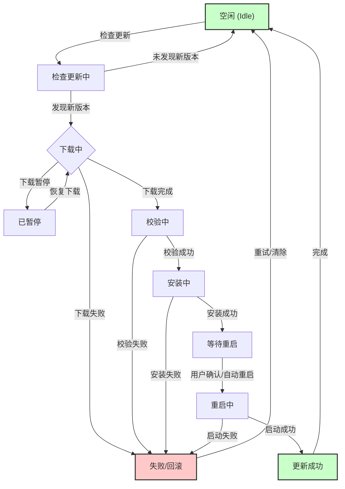

# 1.OTA状态机

有四个概念：

- State：一个状态机至少包含两个状态
- Event：事件就是执行某个操作的触发条件或口令（“把灯打开”，“把灯关上”）
- Action：事件发生后要执行的动作（开灯，关灯）
- Transition：从一个状态变到另一个状态

**OTA流程为何需要状态机？**

OTA更新过程并非简单的文件下载和安装，它涉及到网络连接、电量管理、用户交互、文件校验、版本回滚等多个环节，每个环节都可能出现异常。引入状态机，可以将复杂的OTA流程分解为一系列定义清晰、易于管理的独立状态，从而带来诸多优势：

- **逻辑清晰，易于管理：** 每个状态只关注特定的任务，降低了系统的复杂性。
- **增强鲁棒性：** 明确定义了各种成功和失败路径，使得系统在遇到网络中断、电量不足或用户取消等异常情况时，能够安全地进入预设的失败或暂停状态，并具备恢复和重试的能力。
- **提升用户体验：** 状态机可以精确地追踪更新进度，向用户提供明确的状态反馈，例如“正在下载”、“准备安装”、“更新成功”等。
- **保障设备安全：** 严格的状态转换逻辑可以防止设备在不安全的情况下（如低电量）执行关键更新操作，降低变“砖”风险。

# 2.OTA流程

1. 制作升级包
2. 下载升级包
3. 验签升级包
4. 更新程序

# 3.升级方式

## 3.1 后台下载

在升级的时候，新固件在后台静默下载（用户正常使用程序，感知不到固件正在加载），即**固件下载是属于原来程序功能的一部分**，在新固件下载的过程中，应用可以正常的使用。

下载完成后，系统跳到bootloader，**由bootloader完成新固件覆盖老固件的操作**。

**【总结】：用户应用程序下载，Bootloader引导程序安装**

## 3.2 前台下载

新固件的下载需要由bootloader程序执行，并且固件的刷写覆盖也是由bootloader完成的，整个过程设备无法进行正常的功能。

在升级的时候，需要事先切换到bootloader程序。

**【总结】：有Bootloader程序下载，也由bootloader程序安装**

# 4.OTA牵扯到的技术

1. 无线传输：WIFI，蓝牙，4G，NB-IOT
2. IAP（In Application Programming，应用中编程），指用户自己编写的程序在运行过程中对User Flash部分区域进行烧写。
   - 芯片的启动过程
   - C语言的编译、链接过程、地址空间
   - sct文件
   - flash操作

## 4.1 STM32的启动过程

1. Boot0和Boot1选择启动方式

   boot0/1 == 0/1

2. 给PC（program counter）寄存器（32b）和SP（stack pointer）赋值
   - C语言语句经过汇编会生成汇编指令，每一条汇编指令占用四个字节（32b），这些指令就是存储在地址`0x08000000`这个地址往后的地址空间里的。**PC指向的是下一条待执行指令**。
   - **SP指向栈空间的栈顶指针**。栈用于函数调用、中断处理、局部变量存储。
   - **`0x08000000`地址单元里保存的值是SP，`0x08000004`中保存的值是PC**（紧紧挨着，因为PC和SP大小都是4个字节）。
3. 进入复位中断（初始化时钟、执行`__main`函数）
4. 进入main函数 

>stm32芯片上电后，程序执行的第一段代码就是一个名叫`Reset_Handler`的函数，所以初始PC指向的地址也就是该函数存放的地址。
>
>**该函数存放的地址在哪里看？**
>
>双击左侧的`project`，在弹出的文件中搜索`Reset_Handler`，发现该函数代码的起始地址在`0x08000261`
>
>
>
>接下来我们看一下PC的初始值是多少
>
>首先在keil中打开魔术棒，在User中的`After Build/Rebuild -> Run #1`中写入`fromelf --bin -o "$L@L.bin" "#L` ，会在`Objects`路径下生成一个`object.bin`文件，在vscode中打开（先要装一个`Hex Editor`插件）
>
>
>
>查看上图中偏移量`offset=4`的地址中存放的内容，就是PC的值，小端存储，最低有效字节（Least Significant Byte, LSB）**会存放在**最低的地址单元。
>
>`61 02 00 08`，所以重新组合变成`08 00 02 61`，即`0x08000261`，和`Reset_Handler`的位置一致。
>
>中断向量表的起始地址，同样在`.map`文件中查看，搜索`__Vectors`，
>
>
>
>- `__Vectors`：中断向量表的起始地址，起始地址为`0x08000000`
>- `__Vectors_End`：中断向量表的终止地址，地址值为`0x08000188`
>- `__Vectors_Size`：中断向量表的总大小，值为`0x00000188`

# 5.STM32启动流程

**第一阶段：硬件启动模式选择**

芯片上电后，由硬件根据 `BOOT0` 和 `BOOT1` 这两个物理引脚的电平状态**决定启动模式**。

- 存储器启动：如果 `BOOT` 引脚配置为这种模式，CPU会跳转到一块特殊的内部ROM去执行 **ST官方预置的Bootloader**。这个模式主要用于通过串口、USB等方式下载固件，俗称“ISP模式”。

- SRAM启动：如果配置为这种模式，CPU会从内部SRAM的起始地址 `0x20000000` 开始取指令执行。这种模式通常只在特定调试场景下使用，因为SRAM是易失的，掉电后程序就没了。
- Flash启动: 这是**最常用**的模式。CPU会从内部Flash闪存的起始地址 `0x08000000` 开始执行。

**第二阶段：Flash启动 - 硬件自动加载**

当确定从Flash启动后，CPU核心（硬件）会自动执行以下固定操作：

1. **SP、PC赋值**：

   CPU会去Flash的起始地址 `0x08000000` 读取第一个32位数，并把它加载到 **SP（堆栈指针）寄存器**。

   接着，CPU读取 `0x08000004` 地址的第二个32位数，并把它加载到 **PC（程序计数器）寄存器**。

2. **中断向量表**：

   上一步读取的这两个值，正是存储在Flash最头部的中断向量表中的前两项。

3. **复位中断**：

   PC寄存器现在已经指向了复位中断服务程序 `Reset_Handler` 的地址，CPU正式开始从该地址取指令，执行软件代码。**硬件的工作到此结束，软件开始接管。**

**第三阶段：软件初始化**

现在，程序流程进入了我们之前讨论过的 `startup_stm32f40xx.o` 启动文件中的 `Reset_Handler` 函数，并执行一系列软件初始化。

1. **初始化时钟**: 通常是调用 `SystemInit()` 函数，配置系统的主时钟、PLL、总线分频等，让MCU“全速运转”。
2. **`__main`函数**: `Reset_Handler` 在完成基本设置后，会跳转到C库函数 `__main`（注意，这是**两个下划线**，不是我们写的`main`）。**这个函数是C运行库的一部分，负责搭建C语言的运行环境**。
3. **初始化堆、栈，初始化RO、RW、ZI段**: 这是 `__main` 函数最重要的工作，它为C代码的运行准备内存。
   - **初始化堆和栈**: 设置堆的边界，确保`malloc`等函数能正常工作。
   - **初始化RW段**: RW (Read-Write)段存放的是**有非零初始值**的全局变量和静态变量。这段代码会把这些初始值从Flash（它们随着`.bin`文件固化在里面）**复制到SRAM**中。
   - **初始化ZI段**: ZI (Zero-Init)段存放的是**未初始化或初始化为0**的全局变量和静态变量。这段代码会将SRAM中对应的这块区域**全部清零**。
4. **跳转到main函数，执行用户代码**: 当C语言环境完全准备好后，`__main` 函数的最后一步就是调用我们自己编写的 `main()` 函数。

至此，芯片的控制权就完全交给了我们自己的应用程序代码。

# 6.Flash中存放的内容

|           地址           |              内容               |
| :----------------------: | :-----------------------------: |
|        0x08000000        |          SP指针初始值           |
|        0x08000004        |          PC指针初始值           |
|        0x08000008        |           中断向量表            |
|          ......          |             ......              |
|   0x08000008 + 4N + 1    |          `__main`函数           |
|          ......          |      部分C库代码占用的空间      |
| 0x08000008 + 4N + 1 + M1 | Reset_Handler，复位中断服务函数 |
|          ......          |       其余的终端服务函数        |
| 0x08000008 + 4N + 1 + M2 |            main函数             |