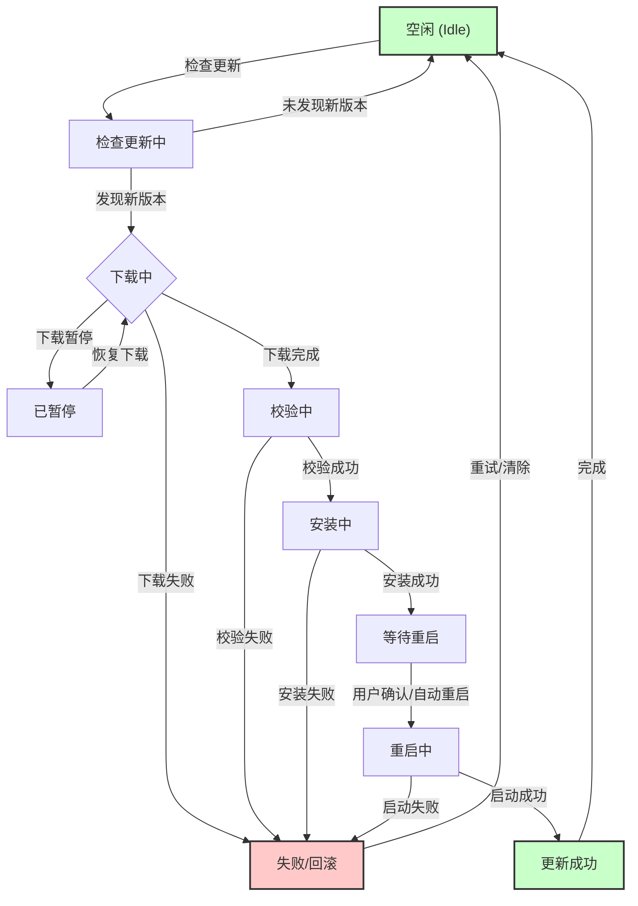

# 1.OTA状态机

有四个概念：

- State：一个状态机至少包含两个状态
- Event：事件就是执行某个操作的触发条件或口令（“把灯打开”，“把灯关上”）
- Action：事件发生后要执行的动作（开灯，关灯）
- Transition：从一个状态变到另一个状态

**OTA流程为何需要状态机？**

OTA更新过程并非简单的文件下载和安装，它涉及到网络连接、电量管理、用户交互、文件校验、版本回滚等多个环节，每个环节都可能出现异常。引入状态机，可以将复杂的OTA流程分解为一系列定义清晰、易于管理的独立状态，从而带来诸多优势：

- **逻辑清晰，易于管理：** 每个状态只关注特定的任务，降低了系统的复杂性。
- **增强鲁棒性：** 明确定义了各种成功和失败路径，使得系统在遇到网络中断、电量不足或用户取消等异常情况时，能够安全地进入预设的失败或暂停状态，并具备恢复和重试的能力。
- **提升用户体验：** 状态机可以精确地追踪更新进度，向用户提供明确的状态反馈，例如“正在下载”、“准备安装”、“更新成功”等。
- **保障设备安全：** 严格的状态转换逻辑可以防止设备在不安全的情况下（如低电量）执行关键更新操作，降低变“砖”风险。

# 2.OTA流程

1. 制作升级包
2. 下载升级包
3. 验签升级包
4. 更新程序

# 3.升级方式

## 3.1 后台下载

在升级的时候，新固件在后台静默下载（用户正常使用程序，感知不到固件正在加载），即**固件下载是属于原来程序功能的一部分**，在新固件下载的过程中，应用可以正常的使用。

下载完成后，系统跳到bootloader，**由bootloader完成新固件覆盖老固件的操作**。

## 3.2 前台下载

新固件的下载需要由bootloader程序执行，并且固件的刷写覆盖也是由bootloader完成的，整个过程设备无法进行正常的功能。

在升级的时候，需要事先切换到bootloader程序。

# 4.OTA牵扯到的技术

1. 无线传输：WIFI，蓝牙，4G，NB-IOT
2. IAP（In Application Programming，应用中编程），指用户自己编写的程序在运行过程中对User Flash部分区域进行烧写。
   - 