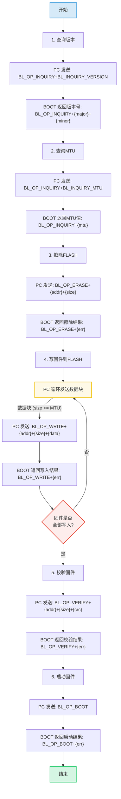

## 升级流程

本章使用bootloader和PC上位机通过串口进行通讯，上位机发送指令，bootloader程序接收指令，完成固件升级。

## 数据传输格式

### 发送格式

| **项目**        | **HEADER** | **OPCODE** | **LENGTH**             | **DATA**       | **CRC32**                                 |
| --------------- | ---------- | ---------- | ---------------------- | -------------- | ----------------------------------------- |
| **长度(bytes)** | 1          | 1          | 2                      | `length`       | 4                                         |
| **内容**        | `0xAA`     | 参考OPCODE | 表示DATA字段的数据长度 | (具体数据内容) | 从HEADER开始到DATA结束的所有内容CRC校验和 |

注：上表中的`DATA`部分其实就是下面的`PARAM`

### OPCODE

| **OPCODE**      | **VALUE** | **PARAM**                                                    | **NOTE**                                                     |
| --------------- | --------- | ------------------------------------------------------------ | ------------------------------------------------------------ |
| `BL_OP_NONE`    | `0x00`    | /                                                            | 未知类型, 异常处理                                           |
| `BL_OP_INQUIRY` | `0x10`    | `VERSION: 0`  `MTU: 1`                                  | 查询BOOT参数 **VERSION**: 查询BOOT版本, 与上位机版本匹配 **MTU**: 一次传输最大数据量 |
| `BL_OP_BOOT`    | `0x11`    | /                                                            | 进入主程序                                                   |
| `BL_OP_RESET`   | `0x1F`    | /                                                            | 重启芯片                                                     |
| `BL_OP_ERASE`   | `0x20`    | `addr`: 地址(4bytes)  `size`: 大小(4bytes)              | 擦除指定区域内容                                             |
| `BL_OP_READ`    | `0x21`    | `addr`: 地址(4bytes)  `size`: 大小(4bytes)              | 回读指定区域内容 (未实现)                                    |
| `BL_OP_WRITE`   | `0x22`    | `addr`: 地址(4bytes)  `size`: 大小(4bytes)  `data`: 待写入数据 | 将data写入addr地址, 写入长度为size                           |
| `BL_OP_VERIFY`  | `0x23`    | `addr`: 地址(4bytes) `size`: 大小(4bytes)  `crc`: 校验和(4bytes) | 校验Flash内容, 若与crc匹配, 则返回BL_ERR_OK                  |

### 响应格式

| **项目**        | **HEADER** | **OPCODE**     | **LENGTH**                        | **ERRCODE**     | **CRC32**                            |
| --------------- | ---------- | -------------- | --------------------------------- | --------------- | ------------------------------------ |
| **长度(bytes)** | 1          | 1              | 2                                 | 1               | 4                                    |
| **内容**        | `0xAA`     | (同请求OPCODE) | 表示ERRCODE段长度 (响应中固定为1) | 参考ERRCODE定义 | 从HEADER到ERRCODE的所有内容CRC校验和 |

### ERRCODE

| **ERRCODE**       | **VALUE** | **NOTE (说明)** |
| ----------------- | --------- | --------------- |
| `BL_ERR_OK`       | `0`       | 操作成功        |
| `BL_ERR_OPCODE`   | `1`       | OPCODE错误      |
| `BL_ERR_OVERFLOW` | `2`       | 长度溢出        |
| `BL_ERR_TIMEOUT`  | `3`       | 操作超时        |
| `BL_ERR_FORMAT`   | `4`       | 格式错误        |
| `BL_ERR_VERIFY`   | `5`       | 校验错误        |
| `BL_ERR_PARAM`    | `6`       | 参数错误        |
| `BL_ERR_UNKNOWN`  | `0xFF`    | 未知错误        |

## 代码讲解

### 项目结构

bootloader部分的代码主要存放在`bootloader.c`文件中。

